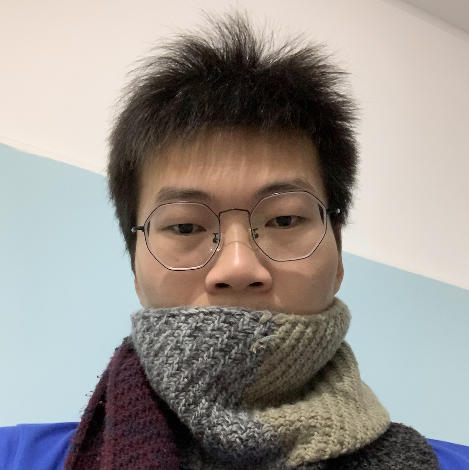

<!-- 引入 layui.css -->
<link href="//unpkg.com/layui@2.7.6/dist/css/layui.css" rel="stylesheet">

    

        

             
            <h6 style="margin-top:5px;">猫大刚 * Mango Mei</h6>
        

    

    

        <fieldset class="layui-elem-field">
            <legend>联系方式</legend>
            

                <i class="layui-icon layui-icon-email" style="color:green;"></i> 邮箱：1092017732@qq.com  
                <i class="layui-icon layui-icon-login-wechat" style="color:green;"></i> 微信：meigangww 
                <i class="layui-icon layui-icon-read" style="color:green;"></i> 博客：http://mg.meiflower.top/mb/  
                <i class="layui-icon layui-icon-star" style="color:green;"></i> csdn：https://blog.csdn.net/mg0324 
            

        </fieldset>
        

            <fieldset class="layui-elem-field">
                <legend>经历</legend>
                

                    <ul class="layui-timeline">
                        <li class="layui-timeline-item" v-for="(node,index) in nodes" :key="index">
                            <i class="layui-icon layui-timeline-axis">&#xe63f;</i>
                            

                            
{{node.year}}

                            

                                {{remark}}
                            

                            

                        </li>
                    </ul>
                

            </fieldset>
        

    

