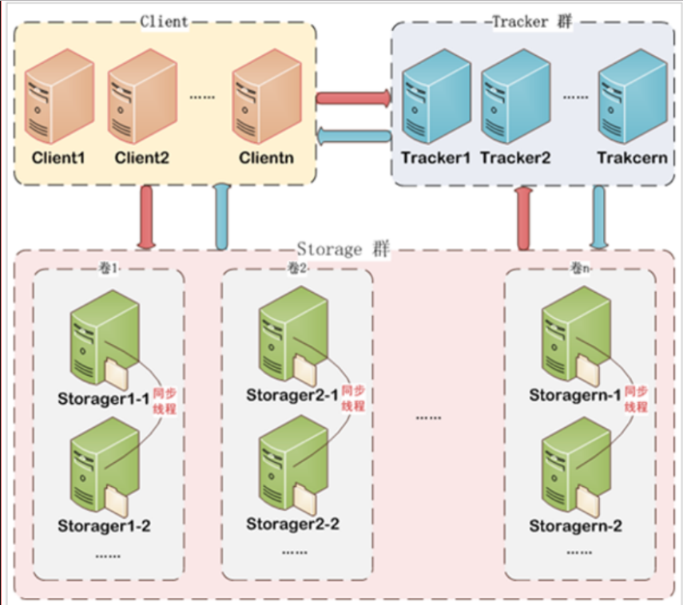
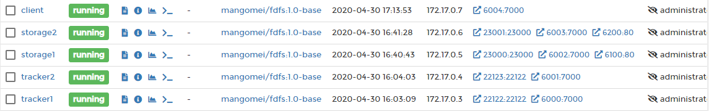
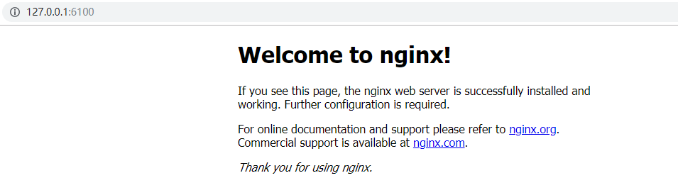
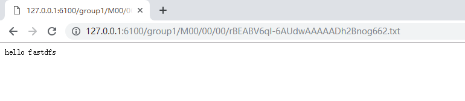

# 分布式存储FastDFS
## 介绍
`FastDFS` 是一个开源的高性能`分布式文件系统（DFS`），实现了文件存储，文件同步和文件访问，以及高容量和负载平衡等功能。<br/> 
`FastDFS` 系统有三个角色：跟踪服务器(`Tracker Server`)、存储服务器(`Storage Server`)和客户端(`Client`)。

[fastdfs作者github](https://github.com/happyfish100)



### Tracker Server
* 跟踪服务器，主要做调度工作，起到均衡的作用；
* 负责管理所有的`storage server`和`group`，每个`storage`在启动后会连接`Tracker`，告知自己所属`group`等信息，并保持周期性心跳。
* 多个`Tracker`之间是构成集群，会自动选主，不存在单点故障。

### Storage Server 
* 存储服务器，主要提供容量和备份服务；
* 以 `group` 为单位，每个 `group` 内可以有多台 `storage server`，组内的`storage server`上的数据互为备份。

### Client 
客户端，上传下载数据的服务器 


## 适用场景
* 非常适合用来存储用户图片、视频、文档等文件。对于互联网应用，和其他分布式文件系统相比，优势非常明显。
> [!ATTENTION]
> 出于简洁考虑，FastDFS没有对文件做分块存储，因此不太适合分布式计算场景。不太适合大文件的存储。


## 集群搭建准备
### 系统软件说明
* centos7.x linux操作系统，用yum install来安装软件包
* libfastcommon-master fastdfs依赖的公共库
* fastdfs-5.11 fastdfs包
* nginx-1.12 nginx
* nginx-fastdfs-module-1.20 nginx的fastdfs模块
### 应用资源安装表
> 本文使用docker来安装部署fdfs集群的实践。



|  服务器  |              运行进程               |  服务器ip  |     端口     |      备注      |
| :------: | :---------------------------------: | :--------: | :----------: | :------------: |
| tracker1 |              trackerd               | 172.17.0.3 |    22122     |                |
| tracker2 |              trackerd               | 172.17.0.4 |    22122     |                |
| storage1 | storaged<br/>nginx + fastdfs-module | 172.17.0.5 | 23000<br/>80 |                |
| storage2 | storaged<br/>nginx + fastdfs-module | 172.17.0.6 | 23000<br/>80 |                |
|  client  |                                     | 172.17.0.7 |              | 用来测试上传的 |

## 安装过程


``` bash
[root@42766f00d9d3 /]# uname -a
Linux 42766f00d9d3 4.14.154-boot2docker #1 SMP Thu Nov 14 19:19:08 UTC 2019 x86_64 x86_64 x86_64 GNU/Linux
```

### 安装libfastcommon库[必须]
1. 下载最新的包
`wget https://github.com/happyfish100/libfastcommon/archive/master.zip`
2. 解压
`unzip master.zip`
3. 进入目录并编译
``` bash
cd libfastcommon-master
./make.sh
```
4. 安装
`./make.sh install`
5. 设置几个软链接、方便后续扩展nginx时使用
```shell
ln -s /usr/lib64/libfastcommon.so /usr/local/lib/libfastcommon.so
ln -s /usr/lib64/libfastcommon.so /usr/lib/libfastcommon.so
ln -s /usr/lib64/libfdfsclient.so /usr/local/lib/libfdfsclient.so
ln -s /usr/lib64/libfdfsclient.so /usr/lib/libfdfsclient.so
```


> [!WARNING]
>  如果`make: cc: Command not found`,说明没有`gcc`,安装执行`yum install -y gcc`


### 安装fastdfs[必须]
1. 下载fastdfs-5.11.zip
`wget https://github.com/happyfish100/fastdfs/archive/V5.11.zip`
2. 解压
`unzip V5.11.zip`
3. 进入目录并编译
``` bash
cd fastdfs-5.11
./make.sh
```
4. 安装
``` bash
./make.sh install
```
5. 查看是否安装成功及版本

    ``` bash
    [root@42766f00d9d3 fastdfs-5.11]# fdfs_test
    This is FastDFS client test program v5.11
    Copyright (C) 2008, Happy Fish / YuQing
    FastDFS may be copied only under the terms of the GNU General
    Public License V3, which may be found in the FastDFS source kit.
    Please visit the FastDFS Home Page http://www.csource.org/
    for more detail.
    Usage: fdfs_test <config_file> <operation>
            operation: upload, download, getmeta, setmeta, delete and query_servers
    ```

> [!WARNING]
> 1. 如果`./make.sh: line 178: perl: command not found`,请执行`yum install -y perl`
> 2. 如果`collect2: error: ld returned 1 exit status`,请尝试先删除目录，重新解包得到新的未编译的目录。


### 安装nginx + fastdfs-module[可选]
1. 下载需要的包

    ``` bash
    wget http://nginx.org/download/nginx-1.12.2.tar.gz
    wget https://github.com/happyfish100/fastdfs-nginx-module/archive/V1.20.zip
    ```

2. 解压

    ```
    unzip V1.20.zip
    tar -zxvf nginx-1.12.2.tar.gz
    ```
3. 进入nginx目录预编译nginx

    ```
    ./configure --add-module=/opt/fastdfs-nginx-module-1.20/src
    ```
4. 编译nginx

    ```
    make
    ```
5. 安装nginx

    ```
    make install
    ```
    
6. 验证nginx安装成功

    ``` bash
    [root@42766f00d9d3 nginx-1.12.2]# ls /usr/local/nginx/
    conf  html  logs  sbin
    ```

    > [!WARNING]
    > 1. nginx版本1.12.2，fastdfs-nginx模块版本是1.20，切忌版本对应，不然可能会在安装过程中出错。
    > 2. 如果`./configure: error: the HTTP rewrite module requires the PCRE library.`,请执行`yum install -y pcre-devel`安装。
    > 3. 如果`./configure: error: the HTTP gzip module requires the zlib library.`,请执行`yum install -y zlib-devel`安装。
    > 4. 如果make出现如下异常
        ``` 
        /usr/include/fastdfs/fdfs_define.h:15:27: fatal error: common_define.h: No such file or directory 
                                #include "common_define.h
        ```
    > 则需要修改如下`vi fastdfs-nginx-module-1.20/src/config`文件，
        ``` ini
        ngx_module_incs="/usr/include/fastdfs /usr/include/fastcommon/" 
        CORE_INCS="$CORE_INCS /usr/include/fastdfs /usr/include/fastcommon/"
        ```
    > 然后重新`./configure` 和 `make`


## 部署过程
> [!TIP]
> `/data/fastdfs`为数据目录

### 部署tracker1

1. 先创建数据目录

    ``` bash
    mkdir -p /data/fastdfs
    ```

2. 复制得到配置文件`/etc/fdfs/tracker.conf`

    ``` bash
    cp /etc/fdfs/tracker.conf.sample /etc/fdfs/tracker.conf
    ```
3. 修改配置文件tracker.conf

    ``` ini
    base_path=/data/fastdfs
    ```
主要修改保存数据路径，其他暂时不变。

4. 启动trackerd

    ``` bash
    fdfs_trackerd /etc/fdfs/tracker.conf
    ```

5. 查看是否启动成功

    ``` bash
    [root@63a682eec736 fdfs]# ps -ef | grep fdfs
    root        23     1  0 08:13 ?        00:00:00 fdfs_trackerd /etc/fdfs/tracker.conf
    root        32     1  0 08:15 pts/0    00:00:00 grep --color=auto fdfs
```

6. 查看tracker日志

    ``` bash
    [root@63a682eec736 fdfs]# tail -1000f /data/fastdfs/logs/trackerd.log
    [2020-04-30 08:13:29] INFO - FastDFS v5.11, base_path=/data/fastdfs, run_by_group=, run_by_user=, connect_timeout=30s, network_timeout=60s, port=22122, bind_addr=, max_connections=256, accept_threads=1, work_threads=4, min_buff_size=8192, max_buff_size=131072, store_lookup=2, store_group=, store_server=0, store_path=0, reserved_storage_space=10.00%, download_server=0, allow_ip_count=-1, sync_log_buff_interval=10s, check_active_interval=120s, thread_stack_size=64 KB, storage_ip_changed_auto_adjust=1, storage_sync_file_max_delay=86400s, storage_sync_file_max_time=300s, use_trunk_file=0, slot_min_size=256, slot_max_size=16 MB, trunk_file_size=64 MB, trunk_create_file_advance=0, trunk_create_file_time_base=02:00, trunk_create_file_interval=86400, trunk_create_file_space_threshold=20 GB, trunk_init_check_occupying=0, trunk_init_reload_from_binlog=0, trunk_compress_binlog_min_interval=0, use_storage_id=0, id_type_in_filename=ip, storage_id_count=0, rotate_error_log=0, error_log_rotate_time=00:00, rotate_error_log_size=0, log_file_keep_days=0, store_slave_file_use_link=0, use_connection_pool=0, g_connection_pool_max_idle_time=3600s
    ```

### 部署tracker2

> 请参考 ** 部署tracker1 ** 步骤操作即可

### 部署stroage1 + nginx

1. 先创建数据目录

    ``` bash
    mkdir -p /data/fastdfs
    ```

2. 复制得到配置文件`/etc/fdfs/storage.conf`

    ``` bash
    cp /etc/fdfs/storage.conf.sample /etc/fdfs/storage.conf
    ```

3. 修改配置文件storage.conf

    ``` ini
    base_path=/data/fastdfs
    store_path_count=1
    store_path0=/data/fastdfs
    tracker_server=172.17.0.3:22122
    tracker_server=172.17.0.4:22122
    ```
    主要修改保存数据路径，其他暂时不变。

4. 启动storaged

    ``` bash
    fdfs_storaged /etc/fdfs/storage.conf
    ```

5. 查看是否启动成功
    ``` bash
    [root@843192fab33c fdfs]# ps -ef | grep fdfs
    root        23     1  6 08:23 ?        00:00:08 fdfs_storaged /etc/fdfs/storage.conf
    root        35     1  0 08:25 pts/0    00:00:00 grep --color=auto fdfs
    ```

6. 查看storaged日志

    ``` bash
    [root@63a682eec736 fdfs]# tail -1000f /data/fastdfs/logs/storaged.log
    ...
    [2020-04-30 08:23:44] INFO - file: tracker_client_thread.c, line: 310, successfully connect to tracker server 172.17.0.3:22122, as a tracker client, my ip is 172.17.0.5
    [2020-04-30 08:23:44] INFO - file: tracker_client_thread.c, line: 1947, tracker server: #0. 172.17.0.3:22122, my_report_status: -1
    [2020-04-30 08:24:14] INFO - file: tracker_client_thread.c, line: 1263, tracker server 172.17.0.3:22122, set tracker leader:172.17.0.3:22122
    ```

    > [!TIP]
    > 1. `store_path_count=1`需要和`store_path*`个数对应起来。
    > 2. 查看storaged.log日志，最后显示连上了tracker则说明启动成功。


7. 修改nginx配置

    ``` bash
    vi /usr/local/nginx/conf/nginx.conf
    #在server节点下新增代理配置
    location ~/group[0-9]/ {
        root /data/fastdfs;
        ngx_fastdfs_module;
    }
    ```

8. 去解压后的fastdfs目录下，将http.conf和mime.types拷贝到/etc/fdfs目录下

    ``` bash
    [root@843192fab33c conf]# ls
    anti-steal.jpg  client.conf  http.conf  mime.types  storage.conf  storage_ids.conf  tracker.conf
    [root@843192fab33c conf]# pwd
    /opt/fastdfs-5.11/conf
    [root@843192fab33c conf]# cp http.conf /etc/fdfs/
    [root@843192fab33c conf]# cp mime.types /etc/fdfs/
    ```

9. 把fastdfs-nginx-module安装目录中src目录下的mod_fastdfs.conf也拷贝到/etc/fdfs目录下

    ``` bash
    [root@843192fab33c src]# ls
    common.c  common.h  config  mod_fastdfs.conf  ngx_http_fastdfs_module.c
    [root@843192fab33c src]# pwd
    /opt/fastdfs-nginx-module-1.20/src
    [root@843192fab33c src]# cp mod_fastdfs.conf /etc/fdfs/
    ```

10. 修改mod_fastdfs.conf配置

    ``` ini
    base_path=/data/fastdfs
    tracker_server=172.17.0.3:22122
    tracker_server=172.17.0.4:22122
    url_have_group_name = true
    group_name=group1
    store_path0=/data/fastdfs

    group_count = 1
    [group1]
    group_name=group1
    storage_server_port=23000
    store_path_count=1
    store_path0=/data/fastdfs
    ```

11. 创建M00至storage存储目录的符号连接

    ``` bash
    ln -s /data/fastdfs/data/ /data/fastdfs/data/M00
    ```

12. 启动nginx

    ``` bash
    [root@843192fab33c fdfs]# /usr/local/nginx/sbin/nginx
    ngx_http_fastdfs_set pid=54
    #有master和worker进程则说明nginx启动成功
    [root@843192fab33c fdfs]# ps -ef | grep nginx
    root        55     1  0 09:04 ?        00:00:00 nginx: master process /usr/local/nginx/sbin/nginx
    nobody      56    55  0 09:04 ?        00:00:00 nginx: worker process
    root        58     1  0 09:04 pts/0    00:00:00 grep --color=auto nginx
    ```

    访问测试：

    


### 部署stroage2 + nginx
请参考 [部署stroage1+nginx](#部署stroage1-nginx) 步骤操作即可


### 使用client测试

1. 复制得到配置文件`/etc/fdfs/client.conf`

    ``` bash
    cp client.conf.sample client.conf
    ```

2. 修改配置
    ``` ini
    base_path=/data/fastdfs
    tracker_server=172.17.0.3:22122
    tracker_server=172.17.0.4:22122
    ```

3. 测试上传

    ``` bash
    [root@e22a928752b0 fdfs]# echo 'hello fastdfs' > test.txt
    [root@e22a928752b0 fdfs]# fdfs_upload_file /etc/fdfs/client.conf test.txt
    [2020-04-30 09:18:13] ERROR - file: ../client/client_func.c, line: 257, "/data/fastdfs" can't be accessed, error info: No such file or directory
    [root@e22a928752b0 fdfs]# mkdir -p /data/fastdfs
    [root@e22a928752b0 fdfs]# fdfs_upload_file /etc/fdfs/client.conf test.txt
    group1/M00/00/00/rBEABV6ql-6AUdwAAAAADh2Bnog662.txt
    ```

4. 测试nginx访问下载

    

## 参考文章
* [FastDFS高可用集群架构配置搭建](https://www.cnblogs.com/sunnydou/p/49b92d511047f4f9da6cd727cfd415d5.html)
* [Nginx和FastDfs完整配置过程](https://blog.csdn.net/qq_34301871/article/details/80060235)


