> 本篇章主要完成对一个8位CPU的设计和实现。

## 前情分析
一个8位CPU设计时，需要实现基础硬件、CPU框架、指令系统、微程序和编译器。

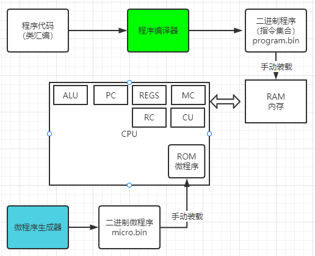


## 硬件部分
经过基础篇修行为止：
* 电源开关POW（基础篇已完成）
* 算数运算单元ALU（基础篇基本完成）
* 程序计数器PC（基础篇已完成）
* 寄存器Register（基础篇已完成）
* 内存控制器MC （基础篇已完成）
* 内存RAM （使用Logic Circuit系统提供的）
* 寄存器控制器RC （待实现）
* 微程序ROM存储器 （使用Logic Circuit系统提供的）
* 控制单元Control Unit （待实现）
* 总线Bus （基本实现）
* CPU框架 （待实现）

### 寄存器控制器RC
#### 实现思路
用5位读写输入，来控制寄存器的读写。（最多控制32个）

#### 寄存器列表

* MSR寄存器：Memory Segment Register，段寄存器。
* MAR寄存器：Memory Address Register，地址寄存器。
* MDR寄存器：Memory Date Register， 存储器数据寄存器
* IR寄存器：Instruction Register，指令寄存器。
* DST寄存器：Destination Register，目标操作数寄存器。
* SRC寄存器：Source Register，源操作数寄存器。
* A寄存器
* B寄存器
* C寄存器
* D寄存器
* 指针及变址寄存器
  * DI寄存器：目的变址寄存器，与DS寄存器连用。
  * SI寄存器：源变址寄存器，与DS寄存器连用。
  * SP寄存器：Stack Point，堆栈指针寄存器，始终只是栈顶的位置, 与SS寄存器一起组成栈顶数据的物理地址。
  * BP寄存器：基址指针寄存器，系统默认其指向堆栈中某一单元, 即提供栈中该单元的偏移量. 加段前缀后, BP可作非堆栈段的地址指针。
* 段寄存器
  * CS寄存器：Code Segment,代码段寄存器，存放当前程序的指令代码。
  * DS寄存器：Data Segment,数据段寄存器，存放程序所涉及的源数据或结果。
  * SS寄存器：Stack Segment,堆栈段寄存器，以”先入后出”为原则的数据区。
  * ES寄存器：Ext Segment,辅助段寄存器，辅助数据区, 存放串或其他数据。
* VEC寄存器：
* T1寄存器：临时寄存器1.
* T2寄存器：临时寄存器2。

目前共21个寄存器。

#### 532译码器电路实现
使用ROM方式实现(32位数中只有一位为1，表示选中)

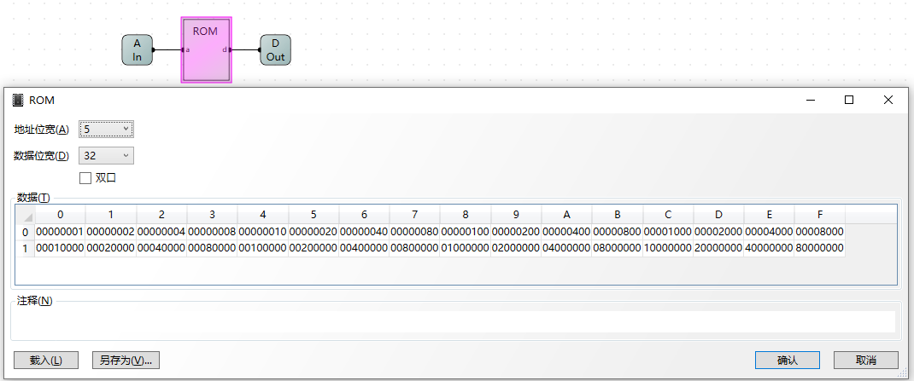

使用python程序生成532.bin后装载到ROM里：
``` python
with open('532.bin', 'wb') as f:
    for i in range(32):
        var = 1 << i
        byte = var.to_bytes(4, byteorder='little')
        print(byte)
        f.write(byte)

print("生成成功")
```

#### 32位异或门
需要32位异或门，避免对寄存器同时读写。

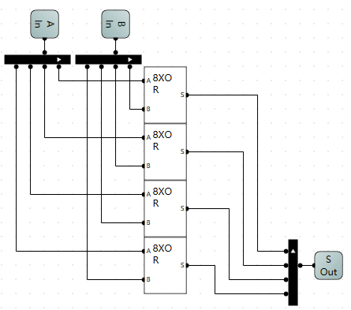

#### RC电路实现

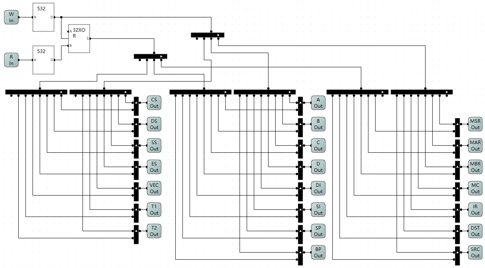

组件管脚顺序：

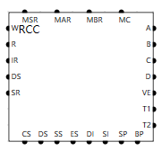

#### RC电路测试

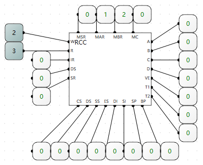

W=2，表示第二个寄存器写，为01。
R=3，表示第3个寄存器读，为10。

### CPU控制器Control Unit
#### 读写控制器RWC

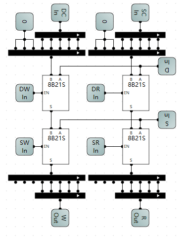

#### CPU控制器电路

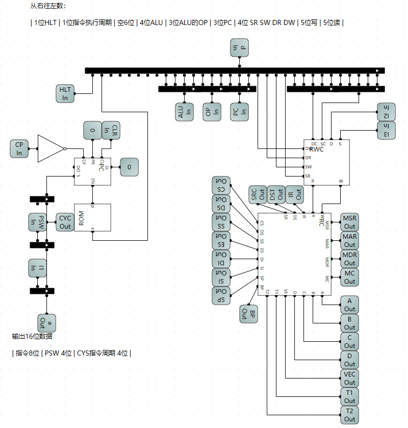

组件显示如下：

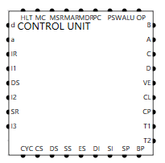

### ALU升级
支持8中操作，分别是加、减、加1、减1、与、或、异或和非。

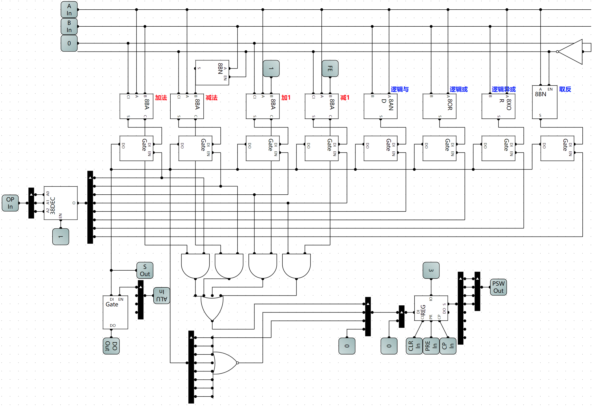

* 支持程序状态字PSW
  * 第一位： 有溢出，为1
  * 第二位： 全位0时，为1
  * 第三位： 奇数偶数位，奇数时为1
  * 第四位： 中断标志（未实现）


## CPU实现

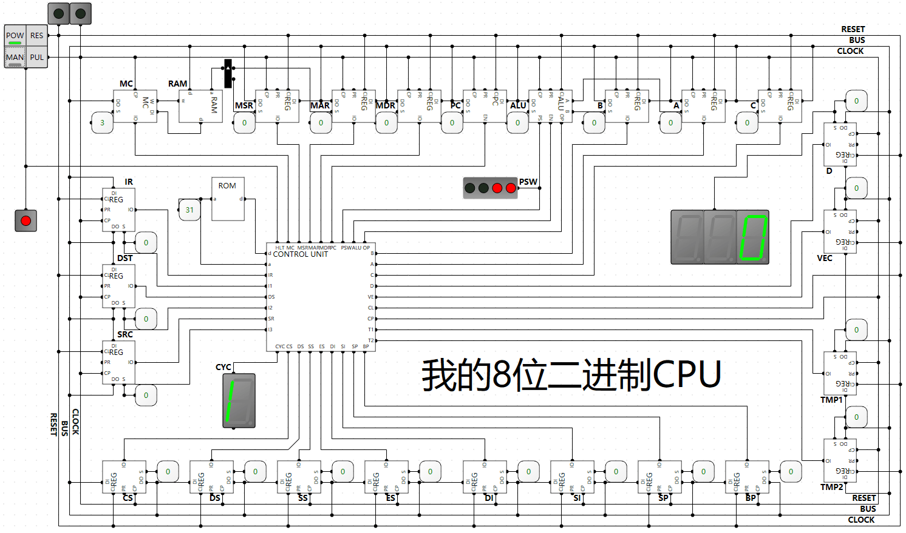

在硬件层面基本设计并实现好了CPU，接下来需要对CPU做软件编程，完成CPU的运行。

## 指令系统
该指令系统是基于寄存器的设计，有多种指令，后续可以不断扩展。（参考汇编语言设计）

### 指令分类
按操作数分类如下：
* 2地址指令
  * MOV A,5; 将常量值5写入到A寄存器
  * ADD B,7; 将B寄存器里的值加7
  * ...
* 1地址指令
  * INC A; A寄存器里的值加1
  * DEC A; A寄存器里的值减1
  * NOT A; A寄存器里的值取反
  * ...
* 0地址指令
  * NOP; 中断指令
  * HLT; 停止指令
  * ...

### 指令中的操作数
* 立即数:是一个常数
* 寄存器操作数：是一个地址，计算速度最快
* 存储器操作数：是一个地址，计算速度最慢

### 指令寻址方式
[指令寻址方式](https://zhuanlan.zhihu.com/p/109398630)有很多种，此处只实现如下4种寻址方式。(微机原理)
* MOV A,5; 立即寻址
* MOV A,B; 寄存器寻址
* MOV A,[5]; 直接寻址
* MOV A,[B]; 寄存器间接寻址

### 指令存储方式
利用16位来存储指令（地址是16进制的）

| 指令 IR 8位 | 程序状态字PSW 4位 | 微程序周期CYC 4位 |

* 2地址指令
  * MOV A,5; 占3个字节
  * IR = 10xx [yy][zz] 
    * 10表示二地址指令标志(67位)
    * xx表示指令助记符（45位）(2位16进制数能表示256个指令)
    * yy表示目标操作数（23位）
    * zz表示源操作数（01位）
* 1地址指令
  * NOT A; 占2个字节
  * IR = 01xxxx[yy]
    * 01表示1地址指令(67位)
    * xxxx表示指令助记符（2345位）(2位16进制数能表示256个指令)
    * yy表示目标操作数（01位）

* 0地址指令
  * HLT; 占一个字节
  * IR=00xx xxxx
    * 00表示0地址指令（67位）
    * xxxxxx表示指令助记符（012345位）（5个16进制数能表示16^5个指令）

## 程序编译器
利用python编写程序编译器，将汇编程序编译为二进制程序码。

代码放到gitee上，地址为：https://gitee.com/mgang/python-study/blob/master/cpu/compiler.py

## 微程序生成器
利用python编写微程序控制器，实现CPU的指令周期。

代码放到gitee上，地址为：https://gitee.com/mgang/python-study/blob/master/cpu/micro-controller.py


## 指令支持实现
原理：将汇编指令通过编译器转换为微程序的微操作，通过将程序（指令）加载到内存后，CPU通过取指周期将指令加载到IR寄存器，将目标操作数加载到DST寄存器，将源操作数加载到SRC寄存器，最后执行。

其中各电路标志定义在如下文件内：https://gitee.com/mgang/python-study/blob/master/cpu/pin.py

### 取指周期 
- 占用6个微操作(已完成)
``` python
FETCH = [
    pin.PC_OUT | pin.MAR_IN,
    pin.RAM_OUT | pin.IR_IN | pin.PC_INC,
    pin.PC_OUT | pin.MAR_IN,
    pin.RAM_OUT | pin.DST_IN | pin.PC_INC,
    pin.PC_OUT | pin.MAR_IN,
    pin.RAM_OUT | pin.SRC_IN | pin.PC_INC,
]
```

> [!TIP]
> 重点：指令周期CYC是4位，则一个指令周期内最多执行2^4=16个微操作。取指周期固定需要6个微操作，因此还剩下10个微操作去实现汇编指令。

### 数据传输指令
#### MOV指令
  * 立即寻址 MOV A,5
  * 寄存器寻址 MOV A,B
  * 直接寻址 MOV 0Xcf,5 或者 MOV A,[5]
  * 寄存器间接寻址 MOV A,[B]
支持4种寻址方式，组合后得到12种实现如下：

``` python
# 这个地方不能用'MOV'字符串的key
MOV: {
    # 1. MOV A,5;
    (pin.AM_REG, pin.AM_INS): [
        pin.DST_W | pin.SRC_OUT,
    ],
    # 2. MOV A,B;
    (pin.AM_REG, pin.AM_REG): [
        pin.DST_W | pin.SRC_R
    ],
    # 3. MOV A,[5] or [0x12]
    (pin.AM_REG, pin.AM_DIR): [
        pin.SRC_OUT | pin.MAR_IN,
        pin.RAM_OUT | pin.DST_W
    ],
    # 4. MOV A,[B]
    (pin.AM_REG, pin.AM_RAM): [
        pin.SRC_R | pin.MAR_IN,
        pin.RAM_OUT | pin.DST_W
    ],
    # 5. MOV [5],5 or MOV [0x12],12
    (pin.AM_DIR, pin.AM_INS): [
        pin.DST_OUT | pin.MAR_IN,
        pin.RAM_IN | pin.SRC_OUT
    ],
    # 6. MOV [5],A;
    (pin.AM_DIR, pin.AM_REG): [
        pin.DST_OUT | pin.MAR_IN,
        pin.RAM_IN | pin.SRC_R
    ],
    # 7. MOV [5],[6]
    (pin.AM_DIR, pin.AM_DIR): [
        pin.SRC_OUT | pin.MAR_IN,
        pin.T1_IN | pin.RAM_OUT,
        pin.DST_OUT | pin.MAR_IN,
        pin.RAM_IN | pin.T1_OUT
    ],
    # 8. MOV [5],[A]
    (pin.AM_DIR, pin.AM_RAM): [
        pin.SRC_R | pin.MAR_IN,
        pin.T1_IN | pin.RAM_OUT,
        pin.DST_OUT | pin.MAR_IN,
        pin.RAM_IN | pin.T1_OUT
    ],
    # 9. MOV [A],5;
    (pin.AM_RAM, pin.AM_INS): [
        pin.DST_R | pin.MAR_IN,
        pin.RAM_IN | pin.SRC_OUT
    ],
    # 10. MOV [A],B;
    (pin.AM_RAM, pin.AM_REG): [
        pin.DST_R | pin.MAR_IN,
        pin.RAM_IN | pin.SRC_R
    ],
    # 11. MOV [A],[5]
    (pin.AM_RAM, pin.AM_DIR): [
        pin.SRC_OUT | pin.MAR_IN,
        pin.RAM_OUT | pin.T2_IN,
        pin.DST_R | pin.MAR_IN,
        pin.RAM_IN | pin.T2_OUT
    ],
    # 12. MOV [A],[B]
    (pin.AM_RAM, pin.AM_RAM): [
        pin.SRC_R | pin.MAR_IN,
        pin.RAM_OUT | pin.T2_IN,
        pin.DST_R | pin.MAR_IN,
        pin.RAM_IN | pin.T2_OUT
    ]
}
```

### 算术运算指令
之前的ALU已经支持了6种操作，分别是加、减、与、或、异或、非；现在扩展2种，分别是加1和减1。（利用硬件来实现++和--，比软件实现简单）

[升级ALU](/skill/basic/compose-cpu-make?id=alu升级)

#### 加法ADD指令
``` python
ADD: {
    # 1. ADD A,5;
    (pin.AM_REG, pin.AM_INS): [
        pin.DST_R | pin.A_IN,
        pin.SRC_OUT | pin.B_IN,
        pin.OP_ADD | pin.ALU_PSW | pin.DST_W | pin.ALU_OUT
    ],
    # 2. ADD A,B;
    (pin.AM_REG, pin.AM_REG): [
        pin.DST_R | pin.A_IN,
        pin.SRC_R | pin.B_IN,
        pin.OP_ADD | pin.ALU_PSW | pin.DST_W | pin.ALU_OUT
    ]
},
```
#### 减法SUB指令
``` python
SUB: {
    # 1. SUB A,5;
    (pin.AM_REG, pin.AM_INS): [
        pin.DST_R | pin.A_IN,
        pin.SRC_OUT | pin.B_IN,
        pin.OP_SUB | pin.ALU_PSW | pin.DST_W | pin.ALU_OUT
    ],
    # 2. SUB A,B;
    (pin.AM_REG, pin.AM_REG): [
        pin.DST_R | pin.A_IN,
        pin.SRC_R | pin.B_IN,
        pin.OP_SUB | pin.ALU_PSW | pin.DST_W | pin.ALU_OUT
    ]
},
```
#### 加一INC指令
``` python
INC: {
    # INC A
    pin.AM_REG: [
        pin.DST_R | pin.A_IN,
        pin.OP_INC | pin.ALU_PSW | pin.DST_W | pin.ALU_OUT
    ]
},
```
#### 减一DEC指令
``` python
DEC: {
    # DEC A
    pin.AM_REG: [
        pin.DST_R | pin.A_IN,
        pin.OP_DEC | pin.ALU_PSW | pin.DST_W | pin.ALU_OUT
    ]
},
```

### 逻辑运算指令
支持与、或、异或和非。

#### 与AND指令
``` python
AND: {
    # 1. AND A,5;
    (pin.AM_REG, pin.AM_INS): [
        pin.DST_R | pin.A_IN,
        pin.SRC_OUT | pin.B_IN,
        pin.OP_AND | pin.ALU_PSW | pin.DST_W | pin.ALU_OUT
    ],
    # 2. AND A,B;
    (pin.AM_REG, pin.AM_REG): [
        pin.DST_R | pin.A_IN,
        pin.SRC_R | pin.B_IN,
        pin.OP_AND | pin.ALU_PSW | pin.DST_W | pin.ALU_OUT
    ]
},
```
#### 或OR指令
``` python
OR: {
    # 1. OR A,5;
    (pin.AM_REG, pin.AM_INS): [
        pin.DST_R | pin.A_IN,
        pin.SRC_OUT | pin.B_IN,
        pin.OP_OR | pin.ALU_PSW | pin.DST_W | pin.ALU_OUT
    ],
    # 2. OR A,B;
    (pin.AM_REG, pin.AM_REG): [
        pin.DST_R | pin.A_IN,
        pin.SRC_R | pin.B_IN,
        pin.OP_OR | pin.ALU_PSW | pin.DST_W | pin.ALU_OUT
    ]
},
```
#### 异或XOR指令
``` python
XOR: {
    # 1. XOR A,5;
    (pin.AM_REG, pin.AM_INS): [
        pin.DST_R | pin.A_IN,
        pin.SRC_OUT | pin.B_IN,
        pin.OP_XOR | pin.ALU_PSW | pin.DST_W | pin.ALU_OUT
    ],
    # 2. XOR A,B;
    (pin.AM_REG, pin.AM_REG): [
        pin.DST_R | pin.A_IN,
        pin.SRC_R | pin.B_IN,
        pin.OP_XOR | pin.ALU_PSW | pin.DST_W | pin.ALU_OUT
    ]
}
```
#### 非NOT指令
``` python
NOT: {
    # NOT A
    pin.AM_REG: [
        pin.DST_R | pin.A_IN,
        pin.OP_NOT | pin.ALU_PSW | pin.DST_W | pin.ALU_OUT
    ]
},
```

### 标记转移指令

思路：代码类型分为代码和标记，将标记的下一条指令记录。出现JMP Label；时，将PC的值设置为Label的下一条指令地址即可。

#### JMP指令
``` python
JMP: {
    # JMP aaaa;
    pin.AM_INS: [
        pin.DST_OUT | pin.PC_IN
    ],
}
```
汇编程序如下：
``` asm
MOV D,1;
a:
    INC D;
    JMP a;
; 停止
HLT;
```
预处理代码时，如果是以冒号结尾则设置代码类型为标记：
``` python
def prepare_source(self):
    # 以冒号结尾,为标记
    if self.source.endswith(':'):
        self.type = self.TYPE_LABEL
        self.name = self.source.strip(':')
        return
    ...
```
编译代码时，支持标记：
``` python
def compile_program():
  global codes
  global marks
  # 读取源代码
  with open(src_name, encoding="utf-8") as file:
      lines = file.readlines()
  # 逐行处理
  for number,line in enumerate(lines):
      # 去掉空格
      source = line.strip()
      # 处理注释
      if ";" in source:
          match = annotation.match(source)
          source = match.group(1)
      if not source:
          continue
      # 加入代码集合
      codes.append(Code(number+1, source))
  # 倒叙处理标记
  result = []
  current = None
  for var in range(len(codes) - 1, -1, -1):
      code = codes[var]
      # 倒叙处理标记，如果是标记则加入到marks字典，是代码则加入代码集合
      if code.type == Code.TYPE_CODE:
          current = code
          result.insert(0, code)
          continue
      if code.type == Code.TYPE_LABEL:
          marks[code.name] = current
          continue
      raise SyntaxError(code)
  # 设置代码当前指令行序号
  for index, var in enumerate(result):
      var.index = index

  # 将代码编译后生成program.bin二进制代码
  with open(dst_name, 'wb') as file:
      for code in result:
          values = code.compile_code()
          print(f'{code} , {values}')
          for value in values:
              result = value.to_bytes(1, byteorder='little')
              file.write(result)
  pass
```
在获取操作数时，如果是标记，则返回立即数和下条指令的地址（乘以3，是因为一条指令占3个字节）
``` python
 # 通过地址获取
def get_am(self, addr):
    global marks
    if addr in marks:
        return pin.AM_INS, marks[addr].index * 3
......
```
### 条件转移指令
条件转移指令依赖比较指令CMP，和ALU中的程序状态字PSW。

#### CMP指令
让2个数做减法，并且将PSW保存起来。（检查电路，特别是ALU的程序状态字部分电路，写入的电路在ALU的第二位）
``` python
CMP: {
    # 1. CMP A,5;
    (pin.AM_REG, pin.AM_INS): [
        pin.DST_R | pin.A_IN,
        pin.SRC_OUT | pin.B_IN,
        pin.OP_SUB | pin.ALU_PSW
    ],
    # 2. CMP A,B;
    (pin.AM_REG, pin.AM_REG): [
        pin.DST_R | pin.A_IN,
        pin.SRC_R | pin.B_IN,
        pin.OP_SUB | pin.ALU_PSW
    ]
},
```
#### 6大条件指令
``` python
# 6大条件跳转，根据PSW来判定
# 溢出跳转
JO = (4 << pin.ADDR1_SHIFT) | pin.ADDR1
# 非溢出跳转
JNO = (5 << pin.ADDR1_SHIFT) | pin.ADDR1
# 零跳转
JZ = (6 << pin.ADDR1_SHIFT) | pin.ADDR1
# 非零跳转
JNZ = (7 << pin.ADDR1_SHIFT) | pin.ADDR1
# 奇数跳转
JP = (8 << pin.ADDR1_SHIFT) | pin.ADDR1
# 非奇数跳转
JNP = (9 << pin.ADDR1_SHIFT) | pin.ADDR1
```
微操作都是将要跳转的指令地址写入到PC中，和JMP指令一样。
``` python
JO: {
    pin.AM_INS: [
        pin.DST_OUT | pin.PC_IN
    ],
},
JNO: {
    pin.AM_INS: [
        pin.DST_OUT | pin.PC_IN
    ],
},
JZ: {
    pin.AM_INS: [
        pin.DST_OUT | pin.PC_IN
    ],
},
JNZ: {
    pin.AM_INS: [
        pin.DST_OUT | pin.PC_IN
    ],
},
JP: {
    pin.AM_INS: [
        pin.DST_OUT | pin.PC_IN
    ],
},
JNP: {
    pin.AM_INS: [
        pin.DST_OUT | pin.PC_IN
    ],
}
```
不过前提是满足某个条件才执行跳转：(在微程序生成器中，根据PSW的状态位和OP来控制对应指令的执行)
```
# 条件跳转指令集合
CONDITION_JMPS = {ASM.JO, ASM.JNO, ASM.JZ, ASM.JNZ, ASM.JP, ASM.JNP}

# 编译1地址指令
def compile_addr1(addr, ir, psw, index):
    # ir=1地址指令时 6位指令 | 2位目标数
    global micro
    global CONDITION_JMPS
    # ir 6位指令 | 2位目标操作数
    op = ir & 0xfc  # 指令助记符
    amd = ir & 3  # 目标操作数

    INST = ASM.INS_SUPPORT_LIST[1]
    # 指令不在支持的指令内，执行指令周期并返回
    if op not in INST:
        micro[addr] = pin.CYC
        return

    am = amd
    if am not in INST[op]:
        micro[addr] = pin.CYC
        return

    # 拿到要执行的指令
    EXEC = INST[op][am]
    # 如果指令是条件跳转指令，则获取跳转指令
    if op in CONDITION_JMPS:
        EXEC = get_condition_jump(EXEC, op, psw)
    if index < len(EXEC):
        micro[addr] = EXEC[index]
    else:
        micro[addr] = pin.CYC
    pass
```

#### asm例子
``` asm
MOV D,1;
aaa:
    INC D
    CMP D,5
    JO aaa
bbb:
    DEC D
    CMP D,0
    JZ aaa
    JNO bbb
; 停止
HLT;
```
测试时效果为：D先从1加到5，再从5减到0，又加到5，再减到0，如此往复。

### 堆栈操作
#### 实现原理
类似于数据结构里的栈Stack，具备后入先出的特性。

首先明确本文中CPU的RAM地址为16位，低8位由MAR指定，高8位由MSR指定。

使用到的寄存器有：
* SP寄存器，Stack Point，指向堆栈的栈顶。
* SS寄存器，Stack Segment，存储堆栈数据的内存段区域。
* CS寄存器，Code Segment，将内存地址高位切换为代码段地址，表示切换回代码地址指令执行。

#### PUSH指令
``` python
PUSH: {
    # push 1，
    pin.AM_INS: [
        # 栈指针减1
        pin.SP_OUT | pin.A_IN,
        pin.OP_DEC | pin.SP_IN | pin.ALU_OUT,
        # 减一后的指针放到内存地址的低位
        pin.SP_OUT | pin.MAR_IN,
        # 堆栈的段指针放到内存地址的高位
        pin.SS_OUT | pin.MSR_IN,
        # 目标数写入到内存
        pin.DST_OUT | pin.RAM_IN,
        # 代码段0写到内存地址高位，表示切换到代码段执行
        pin.CS_OUT | pin.MSR_IN,
    ],
    pin.AM_REG: [
        pin.SP_OUT | pin.A_IN,
        pin.OP_DEC | pin.SP_IN | pin.ALU_OUT,
        pin.SP_OUT | pin.MAR_IN,
        pin.SS_OUT | pin.MSR_IN,
        # 寄存器寻址和立即数区别，在于立即数是直接输出数据到总线，而寄存器寻址是读取寄存器内值输出到总线
        pin.DST_R | pin.RAM_IN,
        # 代码段0写到内存地址高位，表示切换到代码段执行
        pin.CS_OUT | pin.MSR_IN,
    ],
}
```
#### POP指令
``` python
POP: {
    pin.AM_REG: [
        # 栈指针指向内存地址地位
        pin.SP_OUT | pin.MAR_IN,
        # 栈段指向内存地址高位
        pin.SS_OUT | pin.MSR_IN,
        # 将内存栈顶的值读取到目标寄存器
        pin.DST_W | pin.RAM_OUT,
        # 将栈指针加一
        pin.SP_OUT | pin.A_IN,
        pin.OP_INC | pin.SP_IN | pin.ALU_OUT,
        # 代码段0写到内存地址高位，表示切换到代码段执行
        pin.CS_OUT | pin.MSR_IN,
    ],
}
```
#### asm例子
``` asm
; 栈段初始值为1，则内存高位地址为1
mov SS, 1
; 栈指针初始位置16，则下一个栈顶为15，会放到RAM的Ox010f位置
MOV SP, 0x10 ; [0, 0xf]
mov D, 5;

FF:
    push D
    DEC D
    CMP D,0
    JZ EE
    JNO FF

EE:
    pop D
    CMP D,5
    JZ ET
    JO EE

ET:
    HLT
```

前面2行指令为初始化栈的内存地址；然后设置D=5，依次压入栈，且减1，直到为0则开始弹出栈到D中显示。

故可以看到D的值由5到0，再从0到5。且内存中0x010a到0x010f的值为0到5。

* 函数调用
* 内中断

<script>
(function(){
  // js部分如下
  const images = document.querySelectorAll('img')
  // callback是回调函数，，那么一般是需要触发条件才能执行的，一般触发两次（一次为看见目标元素时，另一次为目标元素卡看不见时）
  const callback = entries => {
      entries.forEach(entry => {
          // console.log(entry)
          // entry.isIntersecting为目标元素
          if (entry.isIntersecting) {
              const image = entry.target
              const data_src = image.getAttribute('data-src')
              image.setAttribute('src', data_src)
              // 结束观察，有几张图片就会触发几次
              observer.unobserve(image)
          }
      })
  }
  // 因为IntersectionObserver是构造函数，所以第一步要new一个实例
  const observer = new IntersectionObserver(callback)
  console.info(observer)
  images.forEach(image => {
          // 开始观察
          observer.observe(image)
  })
})();
</script>

