## 缘分

为了知晓了CPU的实现原理，在B站搜索**CPU实现**后，找到了一个非常好的视频教程叫做[一个8位二进制CPU的设计和实现](https://www.bilibili.com/video/BV1aP4y1s7Vf/?spm_id_from=333.999.0.0&vd_source=e7848c18842bb234f7a561509976445e)。

看了之后不仅解开了心中的疑惑，也更加了解熟悉CPU了，感谢UP主[踌躇月光](https://space.bilibili.com/491131440)的分享。

故本节内容多参考以上视频内容，可理解为笔记整理。

## CPU的组成

CPU全称为`central processing unit`，又称中央处理器，芯片样式如下图：


其组成部分如下图：


可以分为运算器和控制器，还有一些缓存（目前工艺多为3级缓存）：

* 运算器
  * 算术逻辑单元 ALU
  * 寄存器（暂存寄存器、累加寄存器、通用寄存器组、标志寄存器等）
* 控制器
  * 程序计数器 PC
  * 指令寄存器 IR
  * 指令译码器
  * 时序信号发生器（时钟频率）
  * 微程序控制器
  * ...

## 前置条件

需要具备如下技能：

* 数字逻辑基础 知道3大逻辑门（与And、或Or、非Not）
* 数字电路软件 [Logic Circuit](https://www.logiccircuit.org/download.html)

## 组合逻辑电路

### 半加器

#### 定义

*半加器*电路是指对两个输入数据位相加，输出一个结果位和进位，没有进位输入的加法器电路。

#### 参数说明

* 输入
  * A：数值a
  * B：数值b
* 输出
  * S：结果sum
  * C：进位carry

#### 真值表


| A | B | S | C |
| - | - | - | - |
| 0 | 0 | 0 | 0 |
| 0 | 1 | 1 | 0 |
| 1 | 0 | 1 | 0 |
| 1 | 1 | 0 | 1 |

#### 公式

```plaintext
S = A^B (A异或B)
C = A&B (A与B)
```

#### 电路实现


#### 电路测试


### 全加器

#### 定义

全加器英语名称为full-adder，是用[门电路](https://baike.baidu.com/item/%E9%97%A8%E7%94%B5%E8%B7%AF/10796427?fromModule=lemma_inlink)实现两个二进制数相加并求出和的组合线路，称为一位全加器。一位全加器可以处理低位进位，并输出本位加法进位。多个一位全加器进行级联可以得到多位全加器。

#### 参数说明

* 输入
  * A：数值a
  * B：数值b
  * CI：进位输入
* 输出
  * S：结果sum
  * C：进位carry

#### 真值表


| A | B | CI | S | C |
| - | - | -- | - | - |
| 0 | 0 | 0  | 0 | 0 |
| 0 | 0 | 1  | 1 | 0 |
| 0 | 1 | 0  | 1 | 0 |
| 0 | 1 | 1  | 0 | 1 |
| 1 | 0 | 0  | 1 | 0 |
| 1 | 0 | 1  | 0 | 1 |
| 1 | 1 | 0  | 0 | 1 |
| 1 | 1 | 1  | 1 | 1 |

#### 公式

```plaintext
S = A ^ B ^ CI (A 异或 B 异或 CI)
C = A&B + CI&（A^B) (A与B 或上 CI与（A异或B）)
```

#### 电路实现


#### 电路测试


### 8位加法器

#### 定义

在有了1位全加器之后，通过组合8个位实现8位的加法器。

> [!WARNING]
> 注意：该加法器暂未支持负数。

#### 参数说明

* 输入
  * A：数值a
  * B：数值b
  * CI：进位输入
* 输出
  * S：结果sum
  * C：进位carry

#### 电路实现


#### 电路测试


> [!TIP]
> 注意：其中数字组件叫做探测器，显示的是16进制。

### 8位取反器

#### 定义

计算机中是通过补码来做减法运算的，所以需要封装带开关的8位取反器。

#### 参数说明

* 输入
  * EN：开启取反开关
  * A：数值A
* 输出
  * S：结果

#### 电路实现

1位的取反器电路如下：


将8个1位的取反器按下图电路组合得到8位取反器：


#### 电路测试


### ALU(支持加法和减法)

#### 支持减法

在8位加法器基础上，支持减法，并处理进位。

```plaintext
计算机中减法原理：
A - B = A + B的补码
B的补码=B取反 + 1
```

#### 进位的处理

真值表如下：


| CI | C | CO |
| -- | - | -- |
| 0  | 0 | 0  |
| 0  | 1 | 1  |
| 1  | 0 | 0  |
| 1  | 1 | 0  |

当CI为0时表示做加法，有进位则保留；当CI为1时表示做减法，抛弃进位。

则`CO = CI取反 & C`，也就是ALU组件中处理进位的电路。

#### 电路优化

如下ALU电路改进支持加法和进位处理:


其中，8BN组件是当EN位真时，8位输入取反输出到S。DE为开启减法标准位，连接到CI和EN上，表示开启加法，且在取法后给进位为1的值，巧妙地用电路表达了取法加1（补码）。

#### ALU测试


### 7段数码管之1灯16进制显示

#### 定义

利用7段数码管显示数值，可以显示16进制数，从0-f。

#### 参数说明

显示的是16进制数，故共16个数，需要一个4个2进制位的输入。

#### 电路实现


（改电路被封装为1L的组件，方便后续扩展）

通过测试可以找出各个数值对应的二进制，如下图8对应的二进制为`0111 1111`。


利用ROM来做数值显示，依次测试可知对应数值的二进制，然后转为16进制写入ROM即可。


| 数值 | 二进制    | 16进制 |
| ---- | --------- | ------ |
| 0    | 0011 1111 | 3F     |
| 1    | 0011 0000 | 30     |
| 2    | 0101 1011 | 5B     |
| 3    | 0100 1111 | 4F     |
| 4    | 0110 0110 | 66     |
| 5    | 0110 1101 | 6D     |
| 6    | 0111 1101 | 7D     |
| 7    | 0000 0111 | 7      |
| 8    | 0111 1111 | 7F     |
| 9    | 0110 1111 | 6F     |
| A    | 0111 0111 | 77     |
| b    | 0111 1100 | 7C     |
| C    | 0011 1001 | 39     |
| d    | 0101 1100 | 5E     |
| E    | 0111 1001 | 79     |
| F    | 0111 0001 | 71     |

#### 电路测试


### 7段数码管之8位16进制显示

#### 定义

将一个8位的2进制数，利用2个7段数码管显示。

#### 电路实现


#### 电路测试


### 7段数码管之8位10进制显示

#### 定义

将一个8位的2进制数，利用3个7段数码管显示。

#### 电路实现


注意：

* 8位的2进制数（整数），范围是0-255，故需要3个7段数码管。
* 1个数码管需要4位输入，则3个需要12位输入，则ROM数据位宽为12。
* 输入的是8位数，则ROM地址位宽为8。

如上数据需填写0-255到ROM数据矩阵中，利用python生成需要的二进制文件。

```python
with open('test.bin', 'wb') as f:
    for i in range(256):
        var = str(i)
        var = int(var, base=16)
        byte = var.to_bytes(2, byteorder='little')
        print(byte)
        f.write(byte)
```

#### 电路测试


> [!WARNING]
>
> 提出问题：如何让001显示为1？想知道答案请查看21选择器章节。

### 21选择器

#### 定义

有2个输入，分别为A和B，以及一个有效位。

有效输出A，无效输出B。

#### 参数说明

* 输入
  * A: 值a
  * B: 值b
  * EN: 有效位
* 输出
  * S：结果

#### 真值表


| EN | A | B | S |
| -- | - | - | - |
| 0  | 0 | 0 | 0 |
| 0  | 0 | 1 | 1 |
| 0  | 1 | 0 | 0 |
| 0  | 1 | 1 | 1 |
| 1  | 0 | 0 | 0 |
| 1  | 0 | 1 | 0 |
| 1  | 1 | 0 | 1 |
| 1  | 1 | 1 | 1 |

#### 公式

```
S  = EN&A + !EN&B (EN与A 或上 非EN与B)
```

#### 电路实现


#### 电路测试


### 8位21选择器

#### 定义

将8个1位的21选择器组合后得到8位的21选择器。

#### 电路实现


#### 电路测试


### 7段数码管增强

#### 定义

将上面封装的[7段数码管组件](/skill/basic/compose?id=_7段数码管之1灯16进制显示)增加有效才显示（基于8位21选择器实现），无效不显示功能。

#### 参数说明

在原来基础上新增是否有效输入。

#### 电路实现


#### 电路测试


### 7段数码管8位10进制显示增强

#### 定义

显示时无效0不显示，如：

* 001 显示为1
* 091 显示为91
* 102 显示为102

#### 电路实现


其中4BN为4位取反组件。

* 百位有效条件：ROM出来的4位值不能位0000，则先取反再与上1111，等到1则为有效。
* 十位有效条件：ROM出来的4位值不能位0000或者百位有效。

#### 电路测试


#### 同理16进制显示增强

电路增强如下：


测试如下：


## 时序逻辑电路

### R-S触发器

#### 定义

**R-S触发器**又名复位-置位触发器（R-复位RESET，S-置位SET。），基本结构是由两个与非门（or或非门）的输入、输出端交叉连接而成。

#### 参数说明

* 输入
  * R：复位Reset标志
  * S：置位Set标志
* 输出
  * Q：值
  * Q‘：值的反

#### 真值表


| R | S | Q | Q’ |
| - | - | - | --- |
| 0 | 0 | Q | Q‘ |
| 0 | 1 | 1 | 0   |
| 1 | 0 | 0 | 1   |
| 1 | 1 | 0 | 0   |

#### 电路实现


#### 电路测试


### D触发器

#### 定义

D触发器是一个具有记忆功能的，具有两个稳定状态的信息存储器件，是构成多种[时序电路](https://baike.baidu.com/item/%E6%97%B6%E5%BA%8F%E7%94%B5%E8%B7%AF/4836638?fromModule=lemma_inlink)的最基本逻辑单元，也是数字逻辑电路中一种重要的单元电路。

D触发器能存储1位的数据，在内存中。（可以用做寄存器）

#### 参数说明

* 输入
  * EN：是否有效
  * Data：数据
* 输出
  * Q：存储的值
  * Q’：值的反

#### 电路实现


#### 电路测试


当EN=1时，Q存储的是D的值。

### D边沿触发器

#### 定义

让计算机在上升沿存储数据，在下降沿做其他事情。能够存储一位的信息。

#### 参数说明

* 输入
  * D：数据
  * CP：时钟上升沿
* 输出
  * Q：存储的值
  * Q‘：值的取反

#### 电路实现

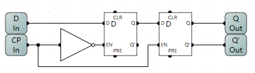

2个D触发器组合，再CP=1时存储D的值到Q中。

#### 电路测试

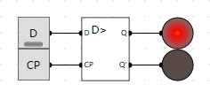

当CP变为1时，会将D中的值设置到Q中。

> [!WARNING]
> 注意：目前为止，触发器每次启动时的Q的值是无序的，需要新增清零和预置状态来优化。

### 触发器优化

#### 定义

以上触发器每次在启动时Q的值都是随机的，为了解决这个问题，需要新增清零和预置状态来优化。

#### 优化思路

R-S触发器增加清零Clear和预置Preset标准，连到3位的或非门上。

#### R-S触发器优化

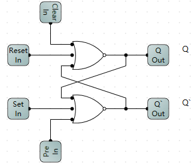

#### D触发器优化

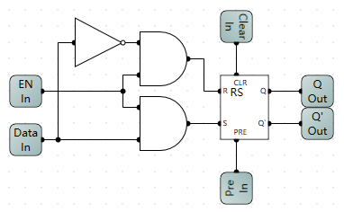

#### D边沿触发器优化

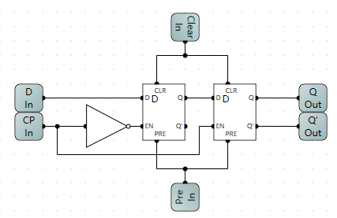

#### D边沿触发器优化后测试

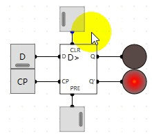

#### D边沿触发器实现跑马灯


### T触发器

#### 定义

T触发器是在数字电路中，凡在CP时钟脉冲控制下，根据输入信号T取值的不同，具有保持和翻转功能的触发器，即当T=0时能保持状态不变，当T=1时一定翻转的电路。

#### 电路实现

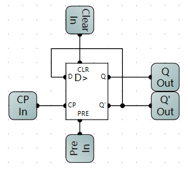

#### 电路测试

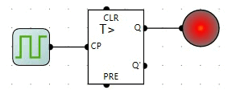

在时钟上升沿时翻转输出值。

### 行波计数器

#### 定义

基于T触发器，实现计数器。

#### 电路实现

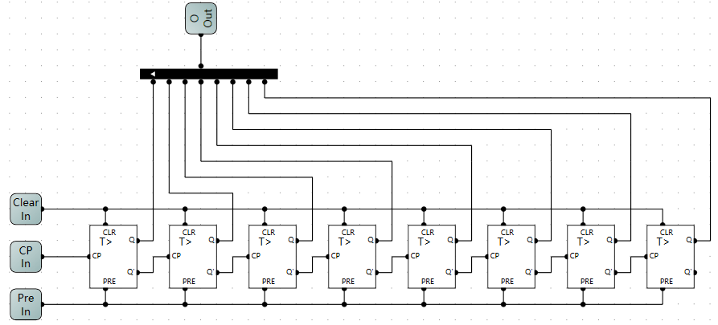

#### 电路测试


## 存储器相关组件

### 8位存储器

#### 定义

首先我们知道一个D边沿触发器能存储一位数据，则将8个组合起来存储8位（1个字节）的存储器。

#### 电路实现

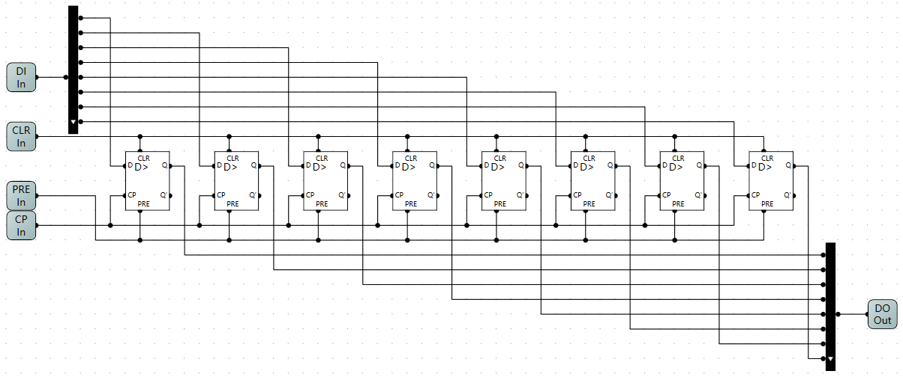

#### 电路测试

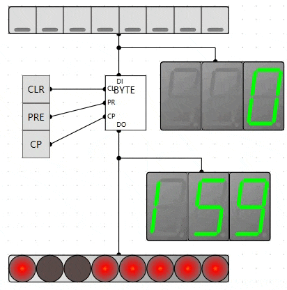

### 8位3态门开关

#### 定位

当一条线路上连接了多个器件时，需要通过3态门来控制哪些连接，哪些断开。

面对一个8位的输入，因此需要8位的3态门开关对应。

#### 电路实现

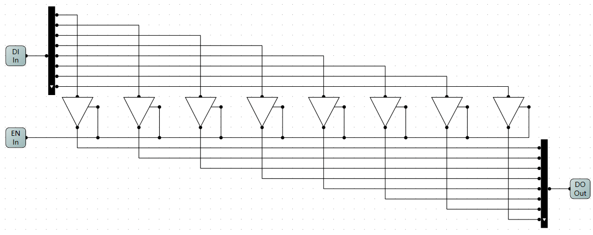

#### 电路测试

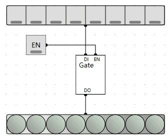

### 8位寄存器

#### 定义

利用存储器存一个字节数据基础上，加上读写控制位。

#### 电路实现

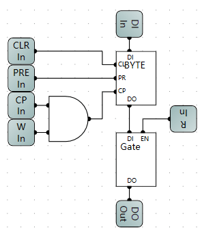

#### 电路测试

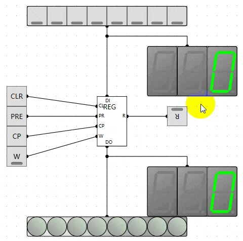

### 38译码器

#### 定义

在组合8个寄存器用来存储8个字节的数据时，遇到一个问题：如何每次只能选中8个寄存器中的一个进行读写？

此时就需要38译码器来做选择控制了。

#### 参数说明

3位输入8位输出，只有一个为1，为1的位置表示选中。

#### 真值表


| A2 | A1 | A0 | B7 | B6 | B5 | B4 | B3 | B2 | B1 | B0 |
| -- | -- | -- | -- | -- | -- | -- | -- | -- | -- | -- |
| 0  | 0  | 0  | -  | -  | -  | -  | -  | -  | -  | 1  |
| 0  | 0  | 1  | -  | -  | -  | -  | -  | -  | 1  | -  |
| 0  | 1  | 0  | -  | -  | -  | -  | -  | 1  | -  | -  |
| 0  | 1  | 1  | -  | -  | -  | -  | 1  | -  | -  | -  |
| 1  | 0  | 0  | -  | -  | -  | 1  | -  | -  | -  | -  |
| 1  | 0  | 1  | -  | -  | 1  | -  | -  | -  | -  | -  |
| 1  | 1  | 0  | -  | 1  | -  | -  | -  | -  | -  | -  |
| 1  | 1  | 1  | 1  | -  | -  | -  | -  | -  | -  | -  |

#### 公式

* B0 = A2‘A1‘A0’ （A2取反 与上 A1取反 与上 A0取反）
* B1 = A2‘A1‘A0 （A2取反 与上 A1取反 与上 A0）
* B2 = A2‘A1A0’ （A2取反 与上 A1 与上 A0取反）
* B3 = A2‘A1A0 （A2取反 与上 A1 与上 A0）
* B4 = A2A1‘A0’ （A2 与上 A1取反 与上 A0取反）
* B5 = A2A1‘A0 （A2 与上 A1取反 与上 A0）
* B6 = A2A1A0’ （A2 与上 A1 与上 A0取反）
* B7 = A2A1A0 （A2 与上 A1 与上 A0）

#### 电路实现

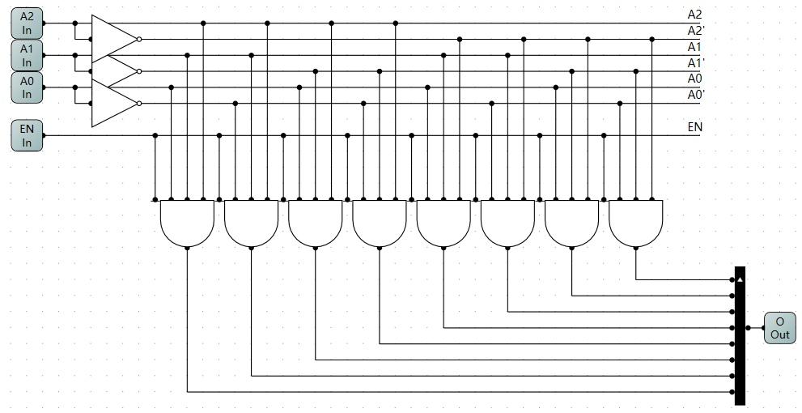

#### 电路测试

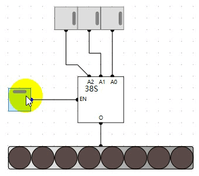

### 8字节存储器

#### 定义

组合8个1字节寄存器组件，利用38译码器选中每次要读写的1个字节寄存器来做数据读取和写入。

#### 电路实现

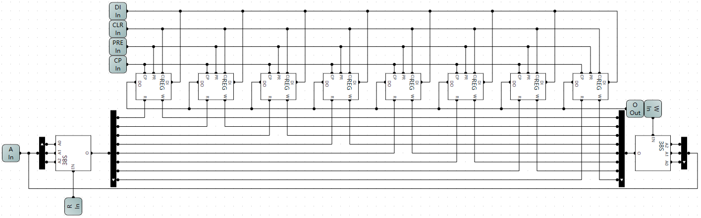

#### 电路测试

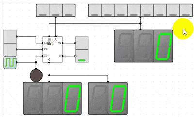

#### 优化后电路

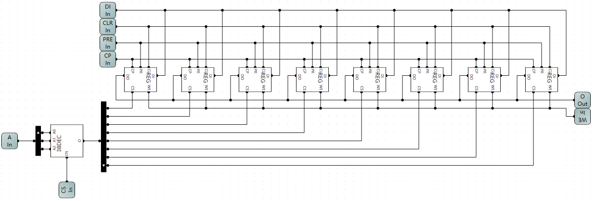

输入优化位CS和WE。（片选信号和写启用信号）

### 存储器扩展

#### 定义

组合2个8x1的字节的存储器，得到8x2字节的存储器。有2种扩展方式，分别是位扩展和字扩展。

#### 位扩展电路实现

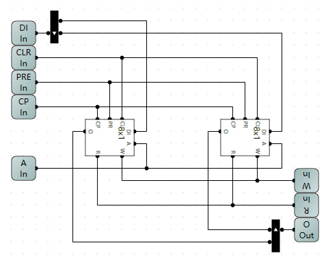

如上图，将2个8x1字节的存储器横向组合，使得数据宽度变成了8x2字节，则称为位扩展。

#### 位扩展电路测试

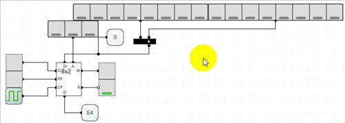

#### 字扩展电路实现

因为16x1是2个8x1的存储器通过字扩展（扩展地址线）组合的，所以需要用到12译码器。（片选其中一个芯片）

##### 12译码器电路

和38译码器类似。

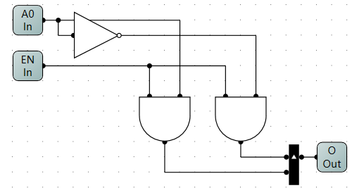

##### 低位交叉编址

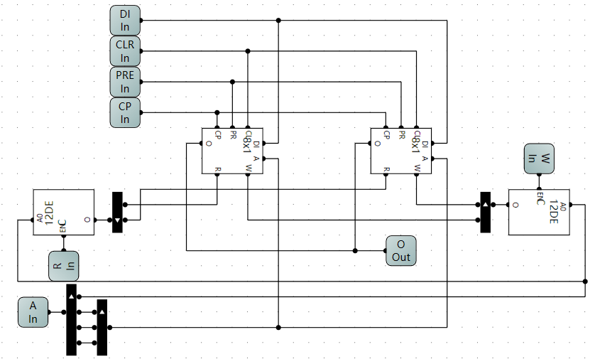

##### 高位交叉编址

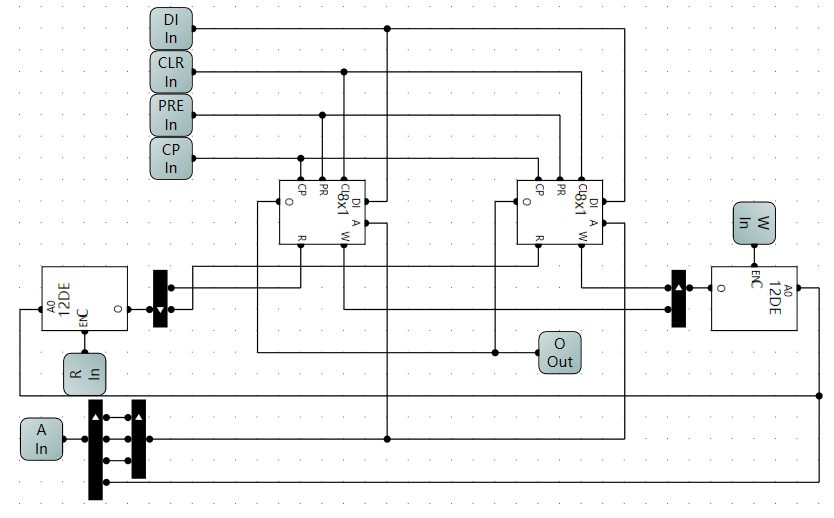

> [!TIP]
> 低位交叉编址推荐使用，因为低位01交替，这样能交替选择不同片，效率高。（同一个组件连续访问需要有一定间隔）

##### 电路测试

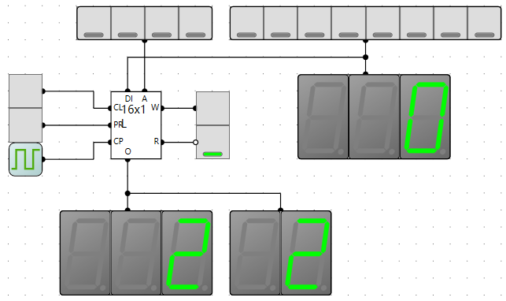

有16个1字节的存储器，通过地址线切换不同的芯片存储数据。

### 存储器的问题

#### 同时读写的问题

可以参考D触发器中Reset和Set不能同时为1的处理逻辑。
将输入从R和W，调整位WE，表示写启用。

#### 接入片选信号

将片选信号作为输入，作为3态门的输入条件之一。

#### 寄存器优化后电路

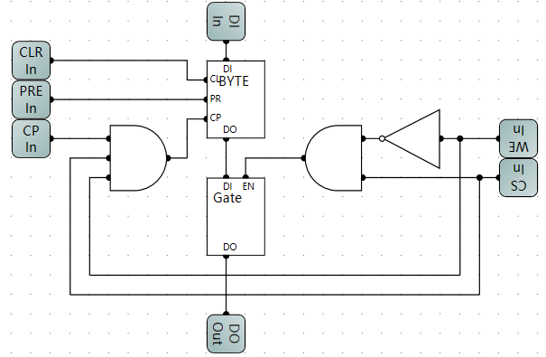

#### 寄存器优化后电路测试

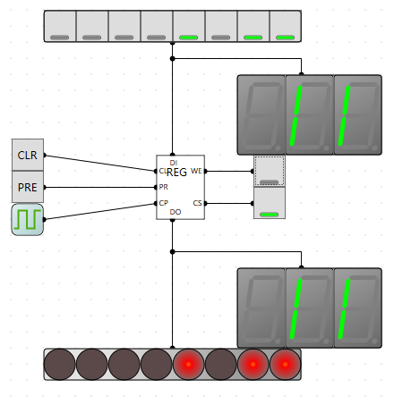

CS=1，输出无法同时读写。

#### 8x1byte优化后电路

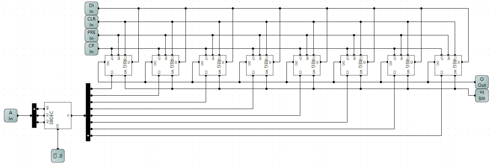

#### 8x2byte优化后电路

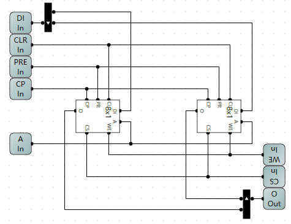

#### 16x1高位优化后电路

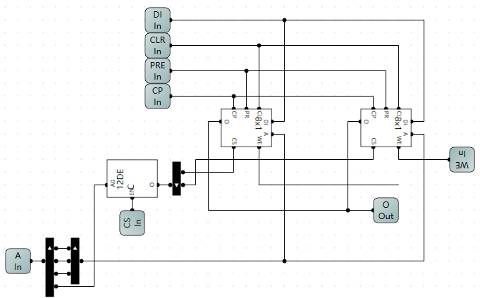

#### 16x1低位优化后电路

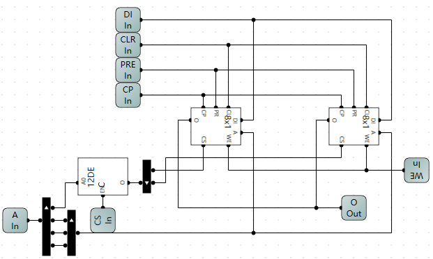


### 3位计数器
#### 定义
在做片选时，需要在8个芯片中选一个索引，因此需要加1的计数器，范围从0-7。
所以可以参考[8位行波极速器](/skill/basic/compose-cpu?id=行波计数器)做出3位的计数器。

#### 电路实现

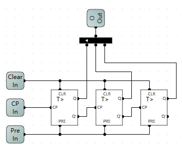

#### 电路测试

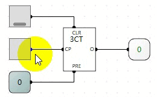

#### 接入地址输入应用

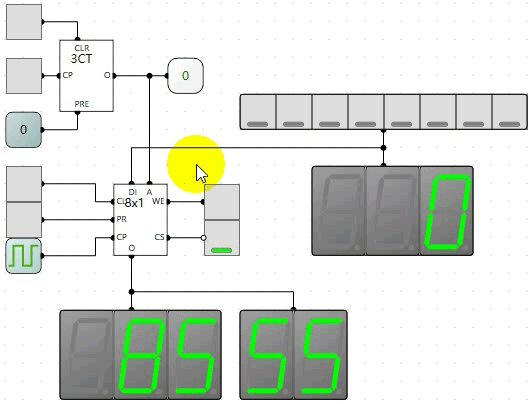

## 核心组件
### ALU
支持加法和减法的ALU实现，详细请参考[ALU](/skill/basic/compose-cpu?id=alu支持加法和减法)

#### ALU增强
* 支持程序状态字
  * 第一位： 有溢出，为1
  * 第二位： 全位0时，为1
  * 第三位： 奇数偶数位
  * 第四位： 中断标志（未实现）
* 支持的运算（通过OP切换）
  * 8位加法(OP=0)
  * 8位减法(OP=1)
  * 8位逻辑与(OP=2)
  * 8位逻辑或(OP=3)
  * 8位逻辑异或(OP=4)
  * 8位逻辑取反（已经有了，请参考[8位取反器](/skill/basic/compose-cpu?id=_8位取反器))(OP=5)

#### 8位逻辑运算组件封装
只贴出8位逻辑与，结构类似，比较简单。

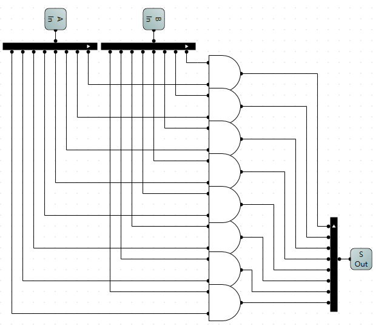

#### ALU增强后电路

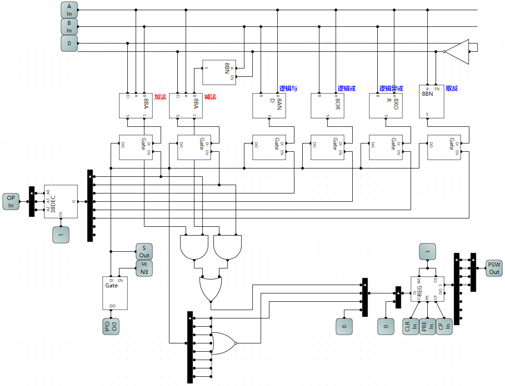

#### ALU增强后测试

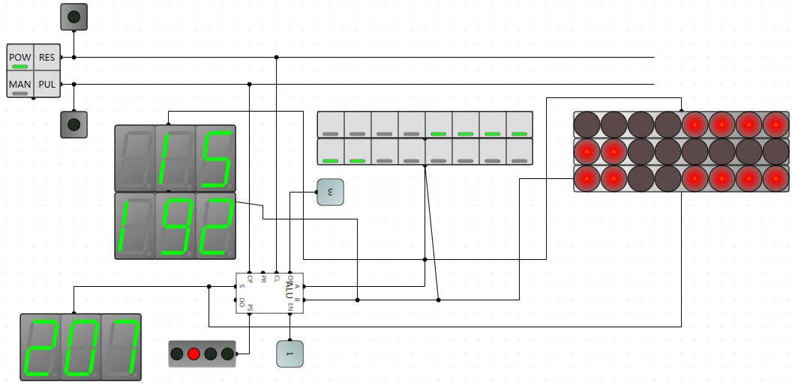

### 寄存器
* [优化前版本](/skill/basic/compose-cpu?id=_8位寄存器)
* [寄存器优化后版本](/skill/basic/compose-cpu?id=寄存器优化后电路)

### 开机电路
#### 参数说明
* 输入
  * Reset：重置信号
  * Power：电源信号
  * Manual： 手动信号
  * Pul： 手动点击信号
  * Halt： 暂停信号
  * CP：时钟信号
* 输出：
  * Reset：重置信号
  * CP：时钟信号

#### 电路实现

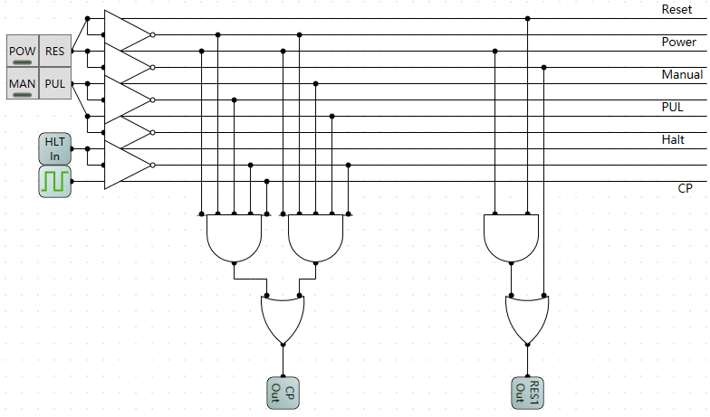

#### 电路测试

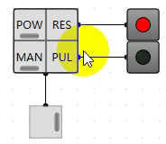

### 程序计数器PC
#### 定义
需要支持写入的增1计数器。

#### 电路实现

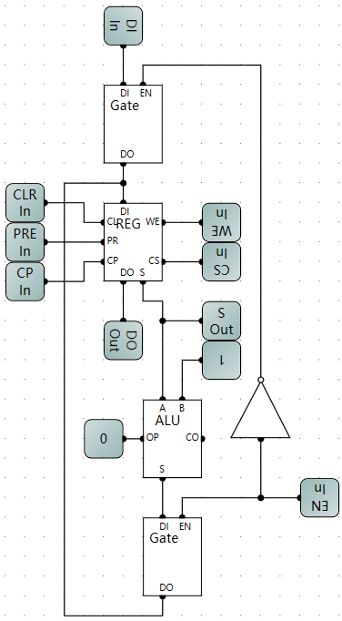

#### 电路测试

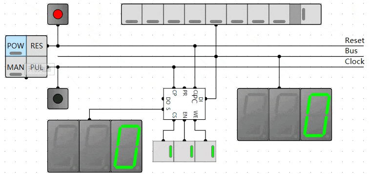

### 内存控制器
#### 说明
其实[存储器相关](/skill/basic/compose-cpu?id=存储器相关组件)的就是内存，但是没有提供的RAM好用。

#### 电路实现

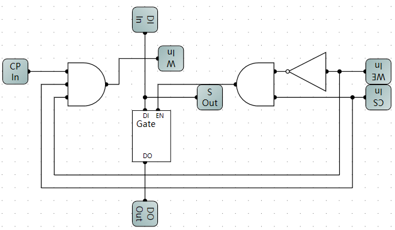

用来控制RAM内存的。

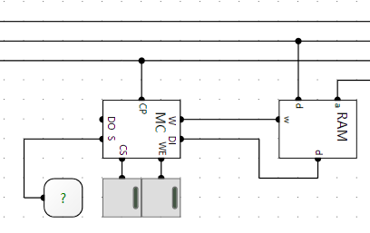

#### 电路测试

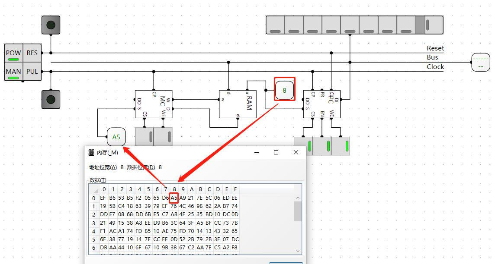

### 总线
可以理解为就是一条线，连接到总线上的组件需要有3态门的支持。（某一个时刻只有一个连通）

目前计算机中有数据总线、地址总线、指令总线等。

## 应用实践
### 半自动加法机
#### 定义
需求：将1到5连续做加法运输，半自动电路实现。

#### 实现说明
* 将1,2,3,4,5分别存到ROM中。
* 利用3位计数器改变地址线。
* 利用ALU实现加法。
* 将加好的结果存到寄存器中。

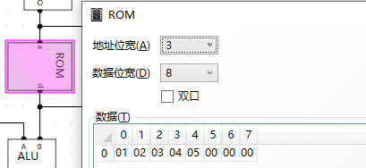

#### 电路实现

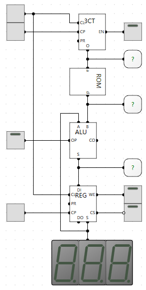

#### 电路测试

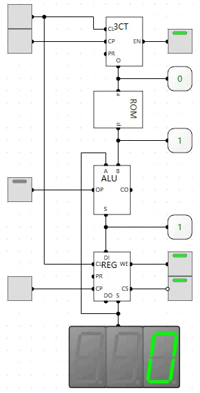


### 全自动加法机
#### 说明
基于[POW开机电路](/skill/basic/compose-cpu?id=开机电路)，将上面半自动加法机修改为全自动加法机。

#### 电路实现

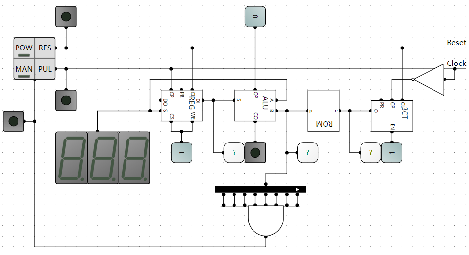

在时钟下降沿时读取ROM中的值做加法，在上升沿的时候将加法结果存到寄存器。

#### 电路测试

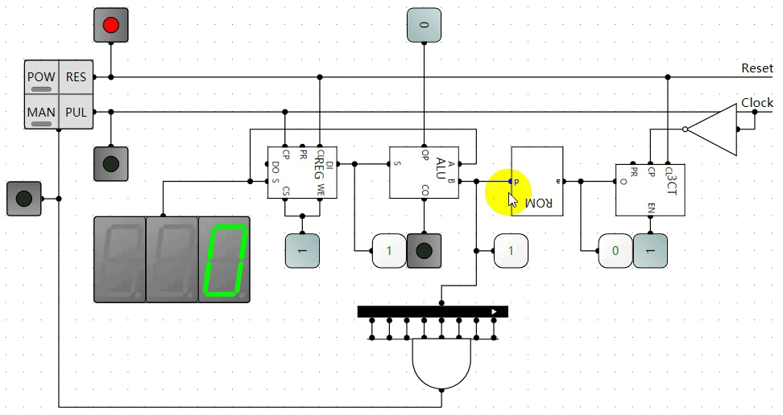

## 微程序控制
### 说明
用微程序来实现指令系统或某些特定控制功能。

### 应用示例说明
有如下RAM内存：

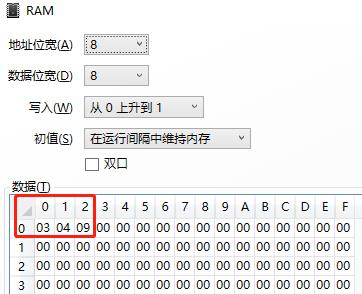

内存里00地址的值为3，01地址的值为4，02地址的值为9。
计算9-(3+4)=2结果设置到第03地址上。

### 前置处理
让ALU加上三态门，支持连接到总线上。

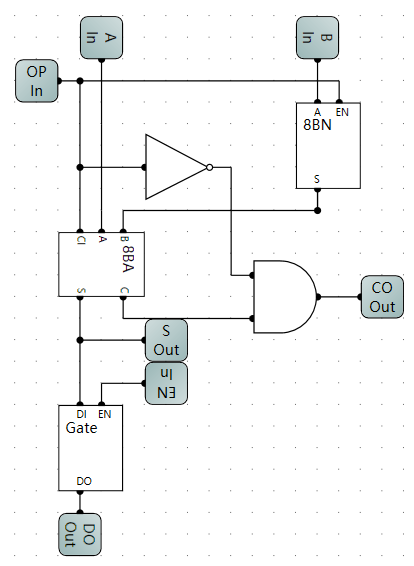

### 电路实现

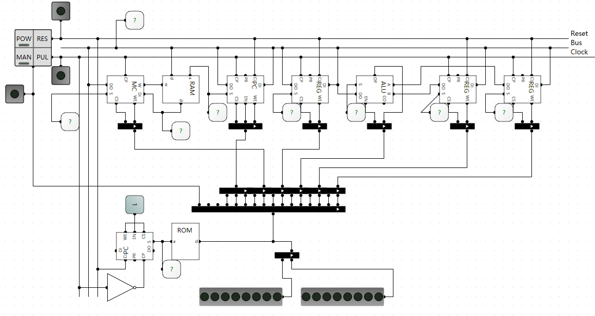

其中微程序控制序列存在ROM中，通过位状态来控制电路运行。

### python编写微程序

``` python
A_WE = 2 ** 0
A_CS = 2 ** 1

B_WE = 2 ** 2
B_CS = 2 ** 3

ALU_SUB = 2 ** 4
ALU_EN = 2 ** 5

C_WE = 2 ** 6
C_CS = 2 ** 7

MC_WE = 2 ** 8
MC_CS = 2 ** 9

PC_WE = 2 ** 10
PC_EN = 2 ** 11
PC_CS = 2 ** 12

HLT = 2 ** 15

micro = [
    # 内存里1地址的数据放到总线上，并存到A寄存器中,PC计数器加一
    A_WE | A_CS | MC_CS | PC_EN | PC_CS | PC_WE,
    # 将内存里2地址的数据写到B寄存器中
    B_WE | B_CS | MC_CS,
    # A寄存器值加B寄存器值计算加法，将结果存到C寄存器，PC计数器加一
    A_CS | B_CS | ALU_EN | C_CS | C_WE | PC_EN | PC_CS | PC_WE,
    # 将C寄存器里的加法结果写入到B寄存器
    B_WE | B_CS | C_CS,
    # 将内存地址3上的数据存到寄存器A
    A_WE | A_CS | MC_CS,
    # A寄存器值减B寄存器值，将结果存到C寄存器，PC计数器加一
    A_CS | B_CS | ALU_EN | ALU_SUB | C_CS | C_WE | PC_EN | PC_CS | PC_WE,
    # 将C寄存器里的结果写入到内存地址4中
    MC_WE | MC_CS | C_CS,
    # 停止
    HLT,
]

with open('micro.bin', 'wb') as f:
    for var in micro:
        byte = var.to_bytes(2, byteorder='little')
        f.write(byte)
        print(var, byte)

print('生成成功')
```
生成的二进制文件装载到ROM中即可。

### 微程序测试

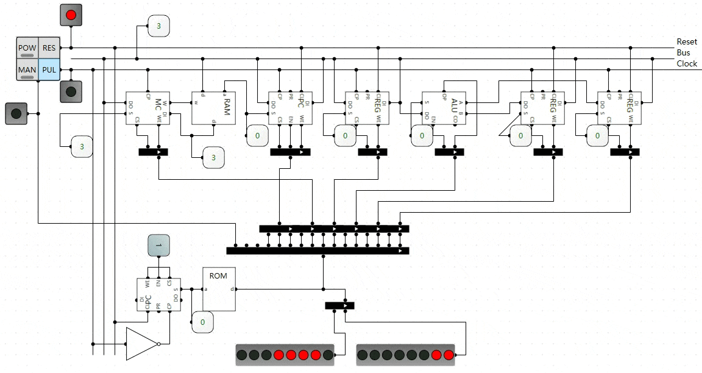


<script>
(function(){
  // js部分如下
  const images = document.querySelectorAll('img')
  // callback是回调函数，，那么一般是需要触发条件才能执行的，一般触发两次（一次为看见目标元素时，另一次为目标元素卡看不见时）
  const callback = entries => {
      entries.forEach(entry => {
          // console.log(entry)
          // entry.isIntersecting为目标元素
          if (entry.isIntersecting) {
              const image = entry.target
              const data_src = image.getAttribute('data-src')
              image.setAttribute('src', data_src)
              // 结束观察，有几张图片就会触发几次
              observer.unobserve(image)
          }
      })
  }
  // 因为IntersectionObserver是构造函数，所以第一步要new一个实例
  const observer = new IntersectionObserver(callback)
  console.info(observer)
  images.forEach(image => {
          // 开始观察
          observer.observe(image)
  })
})();
</script>
