## 缘起

为了更好地学习计算机的组成原理，在此将先抛出计算机组成原理的示意图，然后慢慢深入及展开各个组成部分的设计及实现。

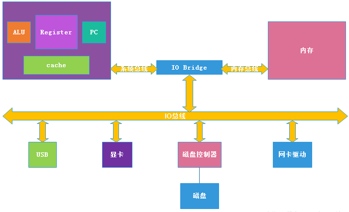

### 主要组成部分

* CPU
* 内存
* 总线
* 输入输出设备

## 修行[CPU]

### 缘分

为了知晓了CPU的实现原理，在B站搜索**CPU实现**后，找到了一个非常好的视频教程叫做[一个8位二进制CPU的设计和实现](https://www.bilibili.com/video/BV1aP4y1s7Vf/?spm_id_from=333.999.0.0&vd_source=e7848c18842bb234f7a561509976445e)。

看了之后不仅解开了心中的疑惑，也更加了解熟悉CPU了，感谢UP主[踌躇月光](https://space.bilibili.com/491131440)的分享。

故本节内容多参考以上视频内容，可理解为笔记整理。

### CPU的组成

CPU全称为`central processing unit`，又称中央处理器，芯片样式如下图：

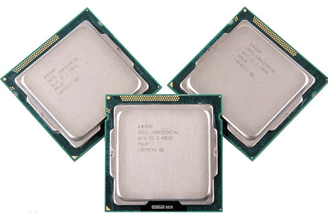

其组成部分如下图：


可以分为运算器和控制器，还有一些缓存（目前工艺多为3级缓存）：

* 运算器
  * 算术逻辑单元 ALU
  * 寄存器（暂存寄存器、累加寄存器、通用寄存器组、标志寄存器等）
* 控制器
  * 程序计数器 PC
  * 指令寄存器 IR
  * 指令译码器
  * 时序信号发生器（时钟频率）
  * 微程序控制器
  * ...

### 前置条件

需要具备如下技能：

* 数字逻辑基础 知道3大逻辑门（与And、或Or、非Not）
* 数字电路软件 [Logic Circuit](https://www.logiccircuit.org/download.html)

### 组合逻辑电路

#### 半加器

##### 定义

*半加器*电路是指对两个输入数据位相加，输出一个结果位和进位，没有进位输入的加法器电路。

##### 参数说明

* 输入
  * A：数值a
  * B：数值b
* 输出
  * S：结果sum
  * C：进位carry

##### 真值表


| A | B | S | C |
| - | - | - | - |
| 0 | 0 | 0 | 0 |
| 0 | 1 | 1 | 0 |
| 1 | 0 | 1 | 0 |
| 1 | 1 | 0 | 1 |

##### 公式

```plaintext
S = A^B (A异或B)
C = A&B (A与B)
```

##### 电路实现

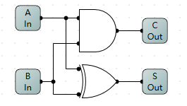

##### 电路测试

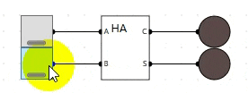

#### 全加器

##### 定义

全加器英语名称为full-adder，是用[门电路](https://baike.baidu.com/item/%E9%97%A8%E7%94%B5%E8%B7%AF/10796427?fromModule=lemma_inlink)实现两个二进制数相加并求出和的组合线路，称为一位全加器。一位全加器可以处理低位进位，并输出本位加法进位。多个一位全加器进行级联可以得到多位全加器。

##### 参数说明

* 输入
  * A：数值a
  * B：数值b
  * CI：进位输入
* 输出
  * S：结果sum
  * C：进位carry

##### 真值表


| A | B | CI | S | C |
| - | - | -- | - | - |
| 0 | 0 | 0  | 0 | 0 |
| 0 | 0 | 1  | 1 | 0 |
| 0 | 1 | 0  | 1 | 0 |
| 0 | 1 | 1  | 0 | 1 |
| 1 | 0 | 0  | 1 | 0 |
| 1 | 0 | 1  | 0 | 1 |
| 1 | 1 | 0  | 0 | 1 |
| 1 | 1 | 1  | 1 | 1 |

##### 公式

```plaintext
S = A ^ B ^ CI (A 异或 B 异或 CI)
C = A&B + CI&（A^B) (A与B 或上 CI与（A异或B）)
```

##### 电路实现

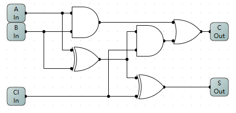

##### 电路测试

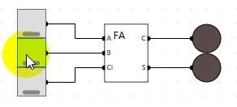

#### 8位加法器

##### 定义

在有了1位全加器之后，通过组合8个位实现8位的加法器。

> [!WARNING]
> 注意：该加法器暂未支持负数。

##### 参数说明

* 输入
  * A：数值a
  * B：数值b
  * CI：进位输入
* 输出
  * S：结果sum
  * C：进位carry

##### 电路实现

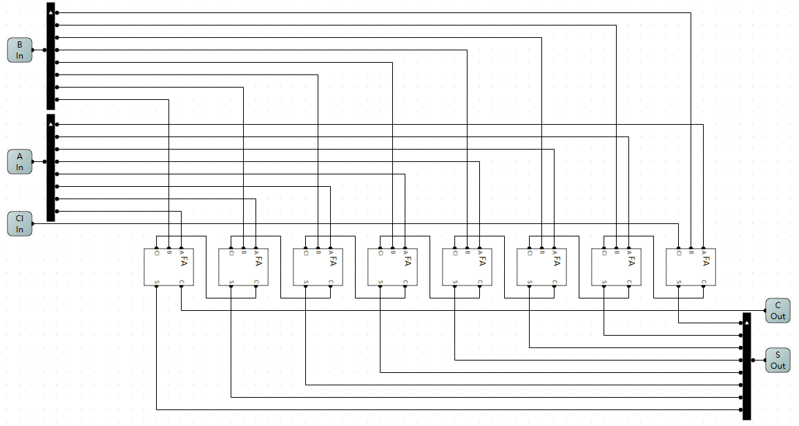

##### 电路测试


> [!TIP]
> 注意：其中数字组件叫做探测器，显示的是16进制。

#### 8位取反器

##### 定义

计算机中是通过补码来做减法运算的，所以需要封装带开关的8位取反器。

##### 参数说明

* 输入
  * EN：开启取反开关
  * A：数值A
* 输出
  * S：结果

##### 电路实现

1位的取反器电路如下：

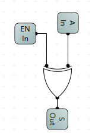

将8个1位的取反器按下图电路组合得到8位取反器：

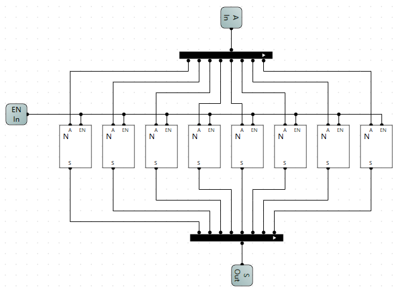

##### 电路测试

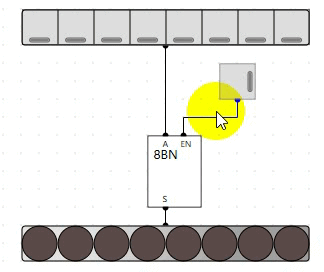

#### ALU(支持加法和减法)

##### 支持减法

在8位加法器基础上，支持减法，并处理进位。

```plaintext
计算机中减法原理：
A - B = A + B的补码
B的补码=B取反 + 1
```

##### 进位的处理

真值表如下：


| CI | C | CO |
| -- | - | -- |
| 0  | 0 | 0  |
| 0  | 1 | 1  |
| 1  | 0 | 0  |
| 1  | 1 | 0  |

当CI为0时表示做加法，有进位则保留；当CI为1时表示做减法，抛弃进位。

则`CO = CI取反 & C`，也就是ALU组件中处理进位的电路。

##### 电路优化

如下ALU电路改进支持加法和进位处理:

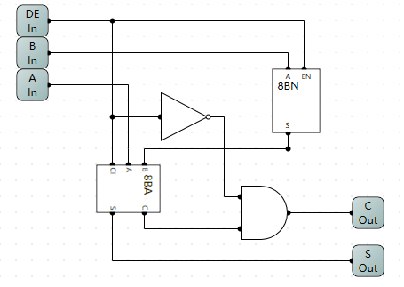

其中，8BN组件是当EN位真时，8位输入取反输出到S。DE为开启减法标准位，连接到CI和EN上，表示开启加法，且在取法后给进位为1的值，巧妙地用电路表达了取法加1（补码）。

##### ALU测试


#### 7段数码管之1灯16进制显示

##### 定义

利用7段数码管显示数值，可以显示16进制数，从0-f。

##### 参数说明

显示的是16进制数，故共16个数，需要一个4个2进制位的输入。

##### 电路实现

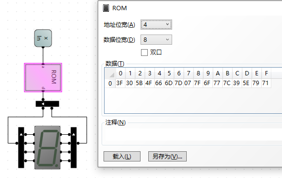

（改电路被封装为1L的组件，方便后续扩展）

通过测试可以找出各个数值对应的二进制，如下图8对应的二进制为`0111 1111`。

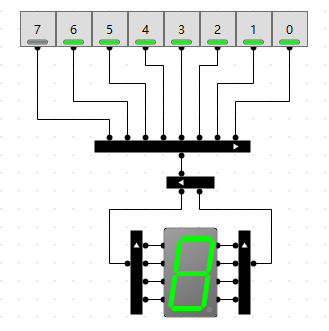

利用ROM来做数值显示，依次测试可知对应数值的二进制，然后转为16进制写入ROM即可。


| 数值 | 二进制    | 16进制 |
| ---- | --------- | ------ |
| 0    | 0011 1111 | 3F     |
| 1    | 0011 0000 | 30     |
| 2    | 0101 1011 | 5B     |
| 3    | 0100 1111 | 4F     |
| 4    | 0110 0110 | 66     |
| 5    | 0110 1101 | 6D     |
| 6    | 0111 1101 | 7D     |
| 7    | 0000 0111 | 7      |
| 8    | 0111 1111 | 7F     |
| 9    | 0110 1111 | 6F     |
| A    | 0111 0111 | 77     |
| b    | 0111 1100 | 7C     |
| C    | 0011 1001 | 39     |
| d    | 0101 1100 | 5E     |
| E    | 0111 1001 | 79     |
| F    | 0111 0001 | 71     |

##### 电路测试

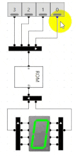

#### 7段数码管之8位16进制显示

##### 定义

将一个8位的2进制数，利用2个7段数码管显示。

##### 电路实现

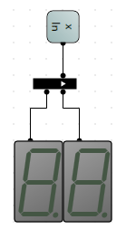

##### 电路测试

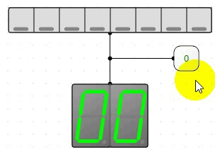

#### 7段数码管之8位10进制显示

##### 定义

将一个8位的2进制数，利用3个7段数码管显示。

##### 电路实现

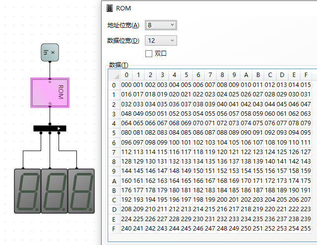

注意：

* 8位的2进制数（整数），范围是0-255，故需要3个7段数码管。
* 1个数码管需要4位输入，则3个需要12位输入，则ROM数据位宽为12。
* 输入的是8位数，则ROM地址位宽为8。

如上数据需填写0-255到ROM数据矩阵中，利用python生成需要的二进制文件。

```python
with open('test.bin', 'wb') as f:
    for i in range(256):
        var = str(i)
        var = int(var, base=16)
        byte = var.to_bytes(2, byteorder='little')
        print(byte)
        f.write(byte)
```

##### 电路测试

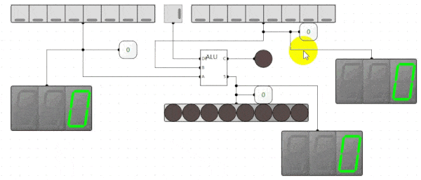

> [!WARNING]
>
> 提出问题：如何让001显示为1？想知道答案请查看21选择器章节。

#### 21选择器

##### 定义

有2个输入，分别为A和B，以及一个有效位。

有效输出A，无效输出B。

##### 参数说明

* 输入
  * A: 值a
  * B: 值b
  * EN: 有效位
* 输出
  * S：结果

##### 真值表


| EN | A | B | S |
| -- | - | - | - |
| 0  | 0 | 0 | 0 |
| 0  | 0 | 1 | 1 |
| 0  | 1 | 0 | 0 |
| 0  | 1 | 1 | 1 |
| 1  | 0 | 0 | 0 |
| 1  | 0 | 1 | 0 |
| 1  | 1 | 0 | 1 |
| 1  | 1 | 1 | 1 |

##### 公式

```
S  = EN&A + !EN&B (EN与A 或上 非EN与B)
```

##### 电路实现

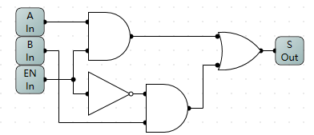

##### 电路测试

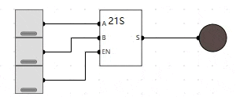

#### 8位21选择器

##### 定义

将8个1位的21选择器组合后得到8位的21选择器。

##### 电路实现

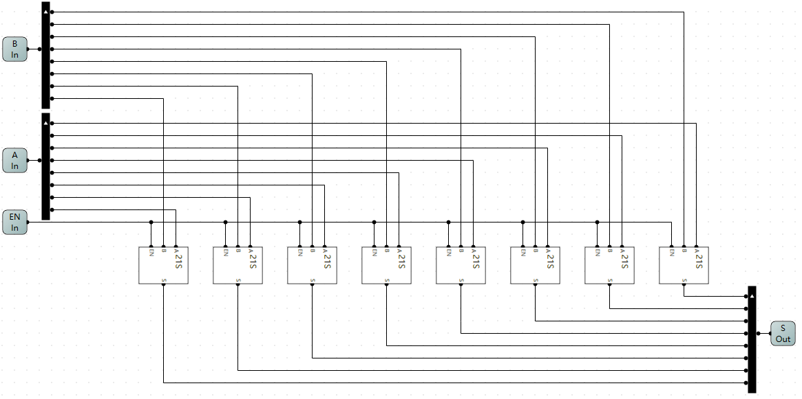

##### 电路测试

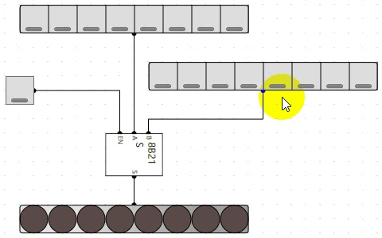

#### 7段数码管增强

##### 定义

将上面封装的[7段数码管组件](/skill/basic/compose?id=_7段数码管之1灯16进制显示)增加有效才显示（基于8位21选择器实现），无效不显示功能。

##### 参数说明

在原来基础上新增是否有效输入。

##### 电路实现

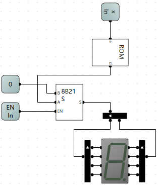

##### 电路测试

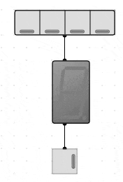

#### 7段数码管8位10进制显示增强

##### 定义

显示时无效0不显示，如：

* 001 显示为1
* 091 显示为91
* 102 显示为102

##### 电路实现

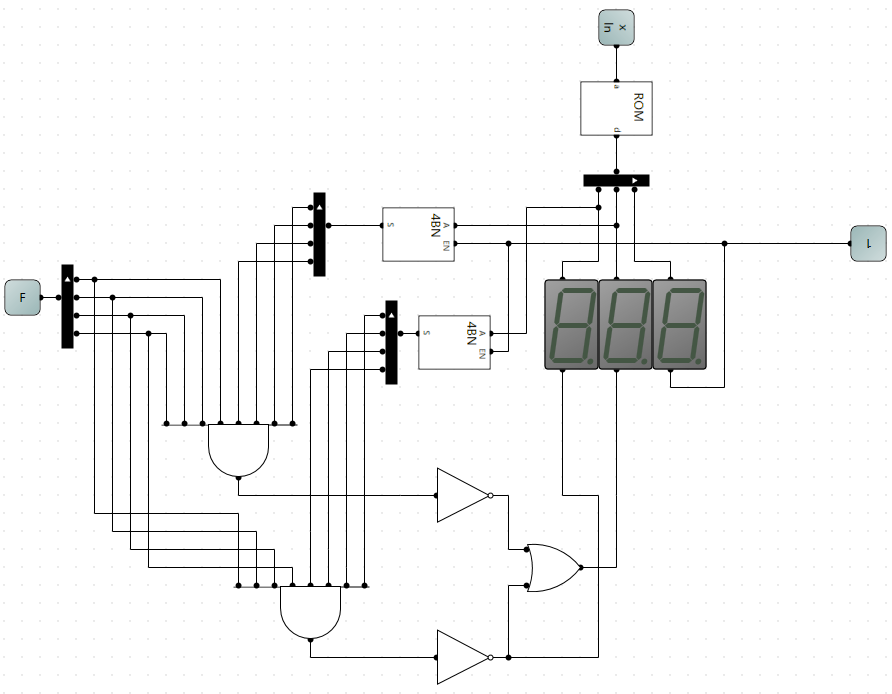

其中4BN为4位取反组件。

* 百位有效条件：ROM出来的4位值不能位0000，则先取反再与上1111，等到1则为有效。
* 十位有效条件：ROM出来的4位值不能位0000或者百位有效。

##### 电路测试

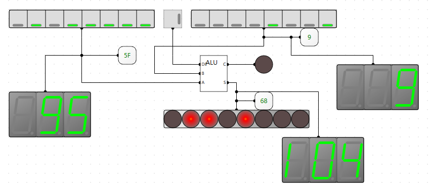

##### 同理16进制显示增强

电路增强如下：

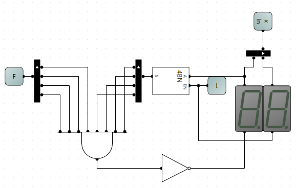

测试如下：

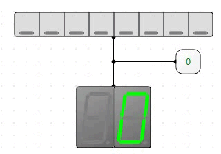

### 时序逻辑电路

#### R-S触发器

##### 定义

**R-S触发器**又名复位-置位触发器（R-复位RESET，S-置位SET。），基本结构是由两个与非门（or或非门）的输入、输出端交叉连接而成。

##### 参数说明

* 输入
  * R：复位Reset标志
  * S：置位Set标志
* 输出
  * Q：值
  * Q`：值取反

##### 真值表


| R | S | Q | Q` |
| - | - | - | -- |
| 0 | 0 | Q | Q` |
| 0 | 1 | 1 | 0  |
| 1 | 0 | 0 | 1  |
| 1 | 1 | 0 | 0  |

##### 电路实现

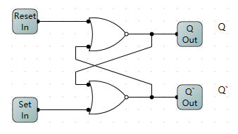

##### 电路测试

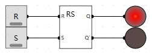

#### D触发器

##### 定义

D触发器是一个具有记忆功能的，具有两个稳定状态的信息存储器件，是构成多种[时序电路](https://baike.baidu.com/item/%E6%97%B6%E5%BA%8F%E7%94%B5%E8%B7%AF/4836638?fromModule=lemma_inlink)的最基本逻辑单元，也是数字逻辑电路中一种重要的单元电路。

D触发器能存储1位的数据，在内存中。（可以用做寄存器）

##### 参数说明

* 输入
  * EN：是否有效
  * Data：数据
* 输出
  * Q：存储的值

##### 电路实现

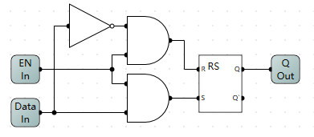

##### 电路测试

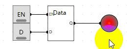

当EN=1时，Q存储的是D的值。
