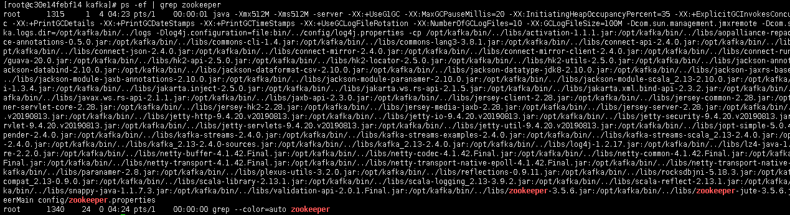
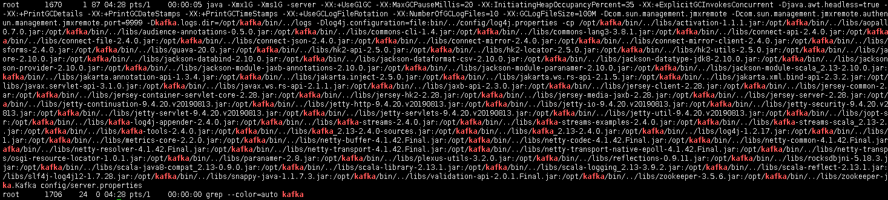
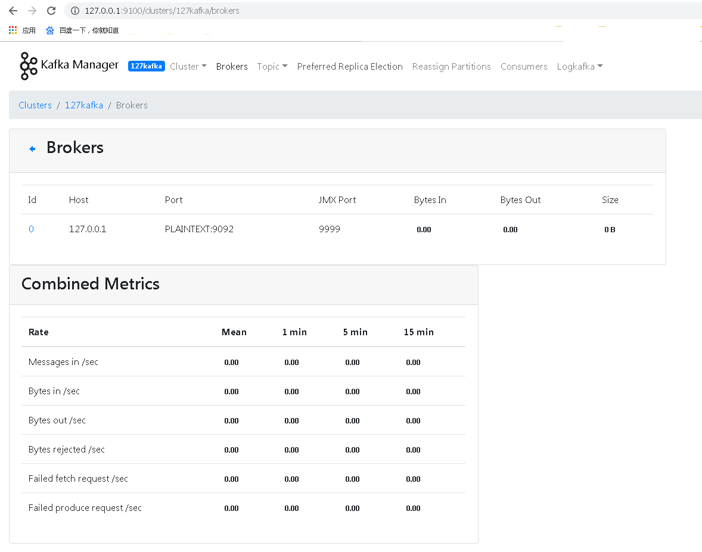

## 介绍
Kafka是一种高吞吐量的分布式发布订阅消息系统，它可以处理消费者在网站中的所有动作流数据。

## 特性

Kafka 是一种高吞吐量的分布式发布订阅消息系统，有如下特性：

- 通过O(1)的磁盘数据结构提供消息的持久化，这种结构对于即使数以TB的消息存储也能够保持长时间的稳定性能。
- 高吞吐量：即使是非常普通的硬件Kafka也可以支持每秒数百万的消息。
- 支持通过Kafka服务器和消费机集群来分区消息。
- 支持[Hadoop](https://baike.baidu.com/item/Hadoop)并行数据加载。

## 环境依赖

* java

centos 可以用如下命令安装jdk1.8

``` bash
yum install -y java
```

* zookeeper

可以使用外部的zookeeper也可以用kafka目录内部的。

## 软件包装备

* kafka_2.13-2.4.0.tgz   -  kafka软件包
* kafka-manager-2.0.0.2-done.zip   -  kafka-manager管理界面程序


也可以到[官网地址](http://kafka.apache.org/downloads)下载

## kafka相关部件部署步骤

先解压kafka包，并进入。一下目录准在`/opt/kafka`下

```shell
tar -zxvf kafka_2.13-2.4.0.tgz
mv kafka_2.13-2.4.0 kafka
cd kafka
```

### 配置并启动内部zookeeper[可选]

1. 修改配置

```shell
vi config/zookeeper.properties
# 修改zk数据目录，可以自己配置
# dataDir=/opt/kafka/tmp/zookeeper
```

2. 启动zookeeper

```shell
bin/zookeeper-server-start.sh -daemon config/zookeeper.properties
```



### 配置并启动kafka

1. 修改配置

```shell
vi config/server.properties
#listeners=PLAINTEXT://127.0.0.1:9092
#log.dirs=/opt/kafka/tmp/kafka-logs
#zookeeper.connect=127.0.0.1:2181
```

2. 启动kafka

   启用jmx端口，支持kafka-manager里的如下选项。

   Enable JMX Polling (Set JMX_PORT env variable before starting kafka server)

``` shell
JMX_PORT=9999 bin/kafka-server-start.sh -daemon config/server.properties
```



### 安装并启动kafka-manager

1. 解压kafka-manager.zip

``` shell
unzip kafka-manager-2.0.0.2-done.zip
mv kafka-manager-2.0.0.2-done kafka-manager
cd kafka-manager
```

2. 修改配置

```shell
vi conf/application.conf
#kafka-manager.zkhosts="127.0.0.1:2181"
```

3. 启动kafka-manager

``` shell
./startup.sh
# nohup bin/kafka-manager -Dhttp.port=9100 &
```




> [!TIP]
> 详细请参考：[Kafka集群管理工具kafka-manager的安装使用](https://www.cnblogs.com/frankdeng/p/9584870.html)