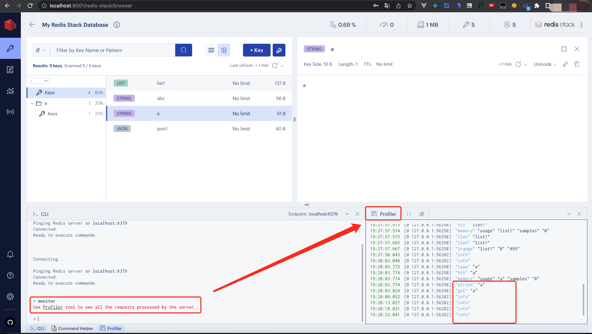
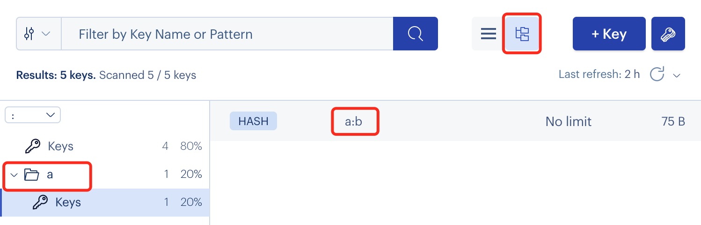

> 以问题驱动学习，问题来源于面试或者是经验提问。
+ Redis的key的长度? +

    最大512M。

    [请跳转查看详细](/skill/qa/for-len?id=redis的key的长度)

+ Redis有多少个数据库? +

    16个，索引从0到15。

+ Redis如何查看服务器正在执行的命令? +

    ```
    redis-cli -h 服务器地址 -a 服务器密码 monitor
    ```
    

+ Redis如何从海量数据中查询某一个Key? +
    
    开发环境可以用`keys [partten]`来查找，正式环境禁用（因为性能问题）。

    可以用`scan`命令（`SCAN cursor [MATCH pattern] [COUNT count]`）来完成可以的查询，如:
    ```
    > SCAN 0 match a* count 1
    1) "2"
    2) 1) "a:b"
    ```

+ Redis的key如何以目录形式表示？ +
    
    使用冒号，key的名称如a:b。
    
