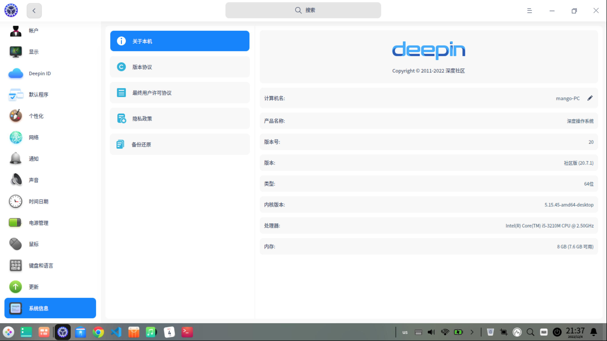
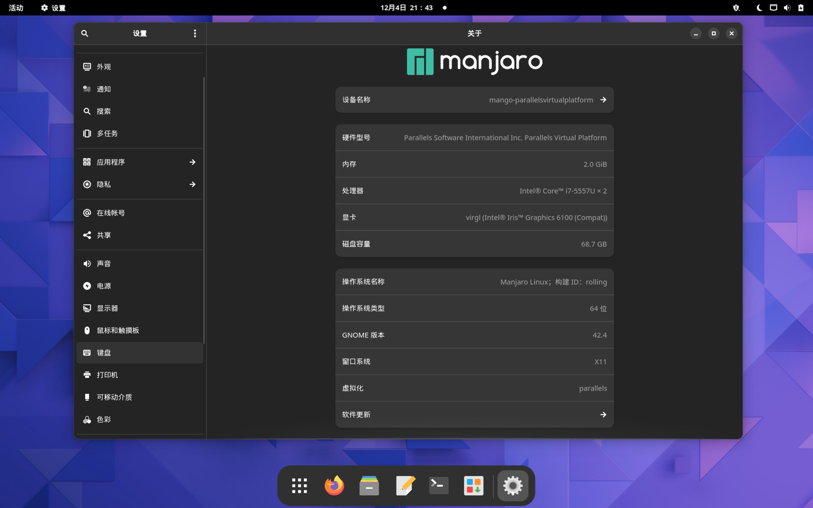
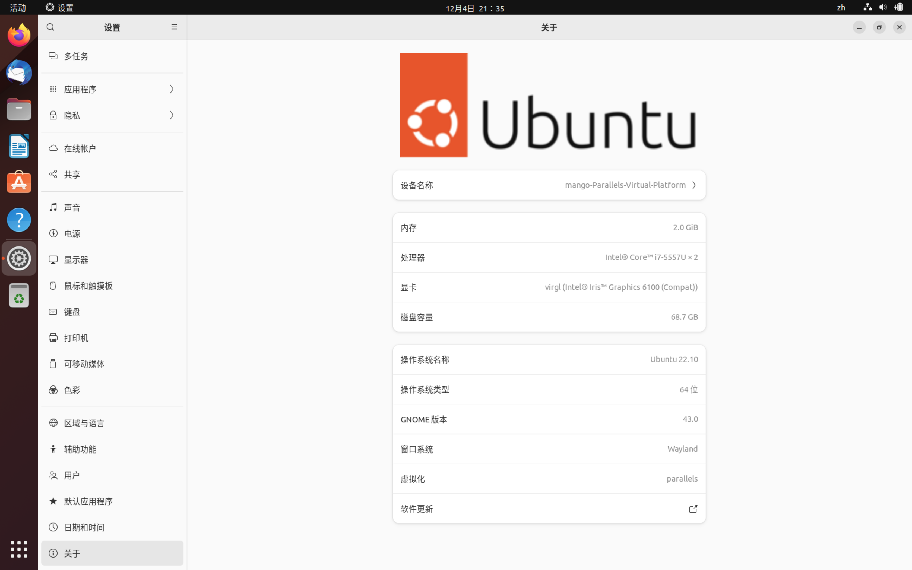
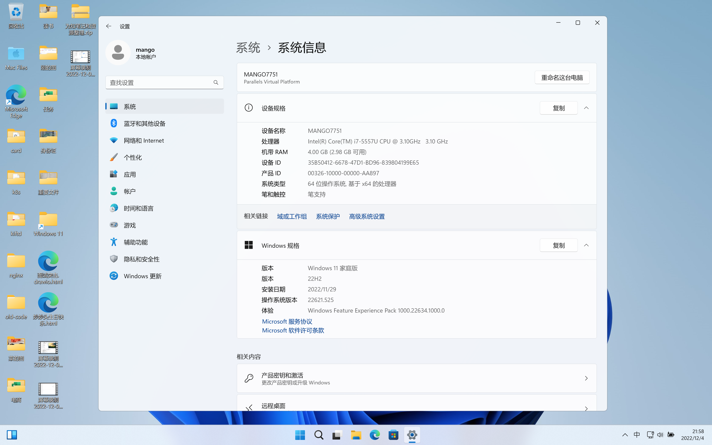

# 分享

## 1. 闲置旧电脑变身高配云服务器
> b站视频地址：https://www.bilibili.com/video/BV1Y841157YF/
* 痛点
  * 低配云服务器过期，续费价格昂贵
    * 双11以新用户购买
* 树莓派或者闲置旧电脑(4C8G)
  * linux开启sshd
  * windows开启远程桌面 - https://blog.csdn.net/mg0324?spm=1019.2139.3001.5343
* 通过frp内网穿透，变身云服务器
  * 需要公网IP

## 2. 各种操作系统尝鲜
- deepin

- manjaro/archlinux

- unbuntu

- macOS

- win11

